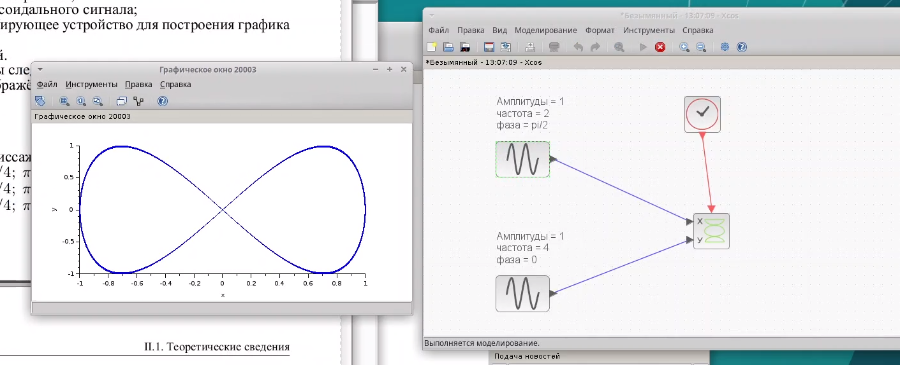

---
## Front matter
lang: ru-RU
title: Лабораторная работа № 5
subtitle: Компонентное моделирование с Scilab и Xcos
author:
  - Мугари Абдеррахим
institute:
  - Российский университет дружбы народов, Москва, Россия
date: 07 марта 2025

## i18n babel
babel-lang: russian
babel-otherlangs: english

## Formatting pdf
toc: false
toc-title: Содержание
slide_level: 2
aspectratio: 169
section-titles: true
theme: metropolis
header-includes:
 - \metroset{progressbar=frametitle,sectionpage=progressbar,numbering=fraction}
---

# Информация

## Преподаватель 

:::::::::::::: {.columns align=center}
::: {.column width="70%"}

  * Анна Владиславовна Королькова
  * доцент кафедры прикладной информатики и теории вероятностей РУДН; 
  * заведующий лабораторией кафедры прикладной информатики и теории вероятностей РУДН (по совместительству); 
  *  программист I кат. 
  * Российский университет дружбы народов
  * [korolkova-av@rudn.ru](mailto:korolkova-av@rudn.ru)

:::
::: {.column width="30%"}


:::
::::::::::::::

## Докладчик

:::::::::::::: {.columns align=center}
::: {.column width="70%"}

  * Мугари Абдеррахим
  * Студент третьего курса 
  * фундаментальная информатика и информационные технологии
  * Российский университет дружбы народов
  * [1032215692@rudn.ru](mailto:1032215692@rudn.ru)
  * <https://iragoum.github.io/>

:::
::: {.column width="30%"}


:::
::::::::::::::


# Цель работы

- Цель работы заключалась в том, чтобы научиться строить и анализировать фигуры Лиссажу, изменяя такие параметры, как амплитуды, частоты и фазовый сдвиг. Кроме того, я познакомился с языком Modelica и инструментом OMEdit, которые используются для моделирования более сложных систем.


# Теоретические сведения

## Scilab и Xcos

**Scilab** — это система компьютерной математики, предназначенная для решения широкого спектра вычислительных задач. Подсистема Xcos предоставляет возможности для моделирования динамических систем с использованием блочно-ориентированного подхода. В **Xcos** можно создавать модели путем соединения таких блоков, как источники сигналов, математические операции и устройства визуализации результатов 

{#fig:001 width=50%}

## Фигуры Лиссажу

- Фигуры Лиссажу представляют собой графики, получаемые при наложении двух ортогональных гармонических колебаний:

$$
\begin{cases}
  x(t) = A \sin(at + \delta), \\
  y(t) = B \sin(bt)
\end{cases}
$$

где:

- A и B — амплитуды сигналов,
- a и b — частоты,
- δ — фазовый сдвиг.

## Modelica и OMEdit

- **Modelica** — это декларативный язык моделирования, применяемый для описания сложных физических систем. Разработка моделей осуществляется в среде **OMEdit**, где можно писать код, компилировать модели и выполнять симуляции 


# Практическая часть

## Построение фигур Лиссажу в Xcos

Для выполнения задания была создана модель в Xcos, позволяющая визуализировать фигуры Лиссажу. Основные этапы построения модели:

- Добавление блока CLOCK_c для задания модельного времени.

- Использование двух генераторов синусоидальных сигналов для создания функций $x(t)$ и $y(t)$.

- Подключение блока CANIMXY для построения анимированного графика.

- Добавление блока TEXT_t для аннотации графика.

## Построение фигур Лиссажу в Xcos

Исходные параметры:

- A = B = 1 
- a = 3, b = 2
- δ = $\pi/2$

В результате была получена кривая Лиссажу

{#fig:002 width=50%}

## Фигура Лиссажу: $A = B = 1, a = 2, b = 2, \delta = 0$

Изменяя фазу в первом генераторе на $\pi/4$, $\pi/2$, $3\pi/4$ и $\pi$ соответственно, получаем различные фигуры Лиссажу 

{#fig:003 width=70%}


## Фигура Лиссажу: $A = B = 1, a = 2, b = 2, \delta = \pi /4$

{#fig:004 width=70%}

## Фигура Лиссажу: $A = B = 1, a = 2, b = 2, \delta = \pi /2$

{#fig:005 width=70%}

## Фигура Лиссажу: $A = B = 1, a = 2, b = 2, \delta = 3\pi /4$

{#fig:006 width=70%}

## Фигура Лиссажу: $A = B = 1, a = 2, b = 2, \delta = \pi$

{#fig:007 width=70%}

## Построение фигур Лиссажу в Xcos

- Далее изменяем частотный параметр второго генератора 

- Проведя моделирование, получаем фигуру Лиссажу с параметрами $A = B = 1, a = 2, b = 4, \delta = 0$ . При изменении фазы в первом генераторе на $\pi/4$, $\pi/2$, $3\pi/4$ и $\pi$ формируются новые фигуры Лиссажу

## Фигура Лиссажу: $A = B = 1, a = 2, b = 4, \delta = 0$

{#fig:008 width=70%}

## Фигура Лиссажу: $A = B = 1, a = 2, b = 4, \delta = \pi /4$

{#fig:009 width=70%}

## Фигура Лиссажу: $A = B = 1, a = 2, b = 4, \delta = \pi /2$

{#fig:010 width=70%}

## Фигура Лиссажу: $A = B = 1, a = 2, b = 4, \delta = 3\pi /4$

{#fig:011 width=70%}

## Фигура Лиссажу: $A = B = 1, a = 2, b = 4, \delta = \pi$

{#fig:012 width=70%}

## Построение фигур Лиссажу в Xcos

- Теперь снова корректируем частотный параметр второго генератора

- После проведения моделирования получаем фигуру Лиссажу с параметрами $A = B = 1, a = 2, b = 6, \delta = 0$ Изменяя фазу в первом генераторе на $\pi/4$, $\pi/2$, $3\pi/4$ и $\pi$, получаем другие фигуры Лиссажу 


## Фигура Лиссажу: $A = B = 1, a = 2, b = 6, \delta = 0$

{#fig:013 width=70%}

## Фигура Лиссажу: $A = B = 1, a = 2, b = 6, \delta = \pi /4$

{#fig:014 width=70%}

## Фигура Лиссажу: $A = B = 1, a = 2, b = 6, \delta = \pi /2$

{#fig:015 width=70%}

## Фигура Лиссажу: $A = B = 1, a = 2, b = 6, \delta = 3\pi /4$

{#fig:016 width=70%}

## Фигура Лиссажу: $A = B = 1, a = 2, b = 6, \delta = \pi$

{#fig:017 width=70%}

## Построение фигур Лиссажу в Xcos

- Наконец, обновляем частотный параметр второго генератора ещё раз

- Проведя моделирование, получаем фигуру Лиссажу с параметрами $A = B = 1, a = 2, b = 3, \delta = 0$ При изменении фазы в первом генераторе на $\pi/4$, $\pi/2$, $3\pi/4$ и $\pi$ формируются дополнительные фигуры Лиссажу 

## Фигура Лиссажу: $A = B = 1, a = 2, b = 3, \delta = 0$

{#fig:018 width=70%}

## Фигура Лиссажу: $A = B = 1, a = 2, b = 3, \delta = \pi /4$

{#fig:019 width=70%}

## Фигура Лиссажу: $A = B = 1, a = 2, b = 3, \delta = \pi /2$

{#fig:020 width=70%}

## Фигура Лиссажу: $A = B = 1, a = 2, b = 3, \delta = 3\pi /4$

{#fig:021 width=70%}

## Фигура Лиссажу: $A = B = 1, a = 2, b = 3, \delta = \pi$

{#fig:022 width=70%}


## Modelica и Openmodelica

- Теперь перейдём к языку Modelica. Это объектно-ориентированный язык для моделирования сложных физических систем.

- Основная идея Modelica – использование блоков, соединение которых автоматически создаёт уравнения.


## Пример дифференциального уравнения

```modelica
Model DU "Решение ДУ"
  Real x(start=1);
equation
  der(x) = -x;
end DU;
```

## Пример дифференциального уравнения

{#fig:023 width=70%}

## Пример дифференциального уравнения

- Открываем OMEdit – графический редактор OpenModelica.
1. Создаём новую модель (File → New Modelica Class).
2. Задаём имя, например DU.
3. Переходим в текстовый режим и редактируем код.
4. Запускаем симуляцию (Simulate)

{#fig:024 width=50%}


- Можно изменить параметры симуляции, например, увеличить Stop Time с 1 до 10. После этого получаем новый график динамики системы. 

{#fig:025 width=70%}


# Выводы

- В ходе выполнения лабораторной работы были изучены и применены методы компонентного моделирования с использованием среды Scilab/Xcos и языка Modelica в OpenModelica.

В результате работы:

- Освоены основные принципы работы с Xcos, включая визуальное программирование, использование палитры блоков и выполнение симуляций.
- Построена и протестирована модель генерации фигур Лиссажу, позволяющая визуализировать зависимости между параметрами синусоидальных сигналов.
- Изучены основные конструкции языка Modelica, включая объявление классов, уравнений и выполнение симуляции дифференциальных уравнений.
- Опробована работа в OpenModelica, включая создание, редактирование и выполнение моделей с анализом графиков. 


