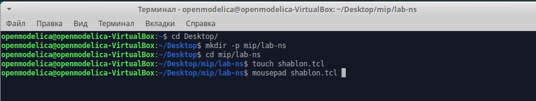
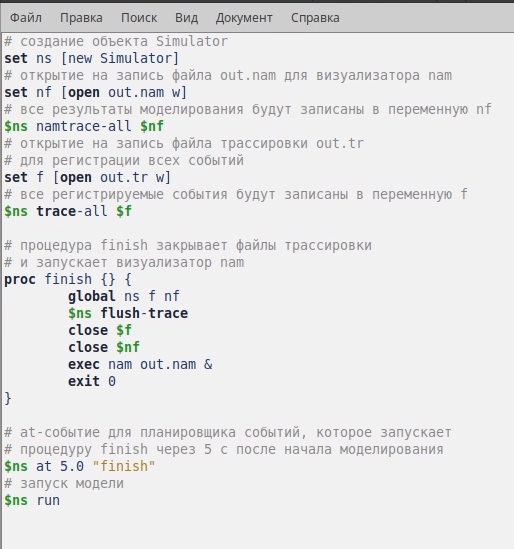
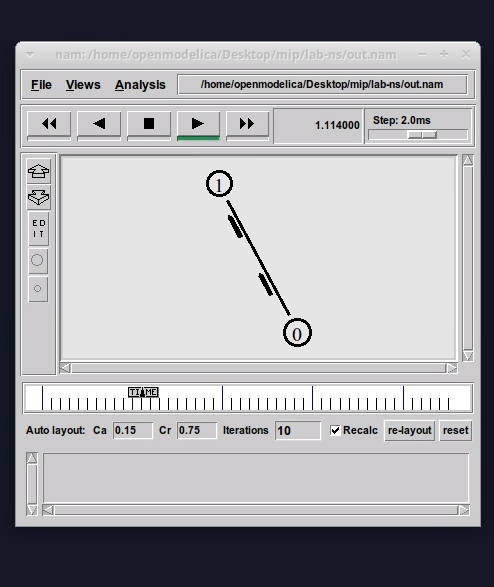
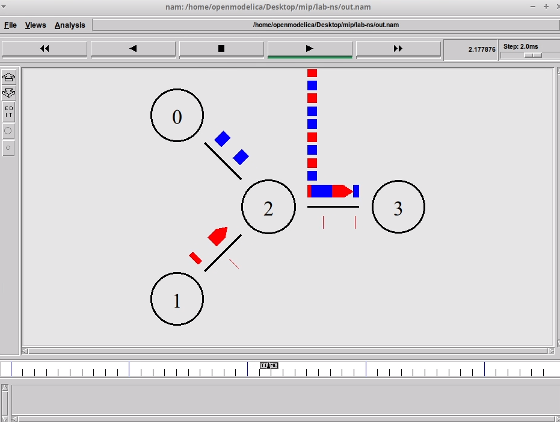
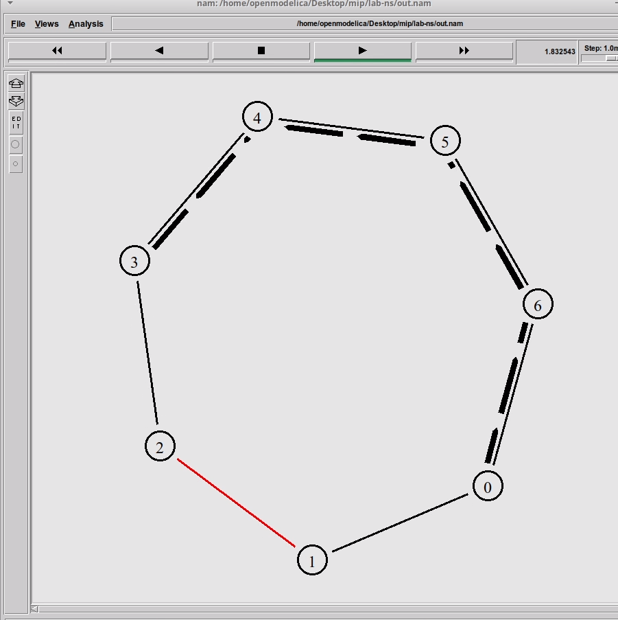
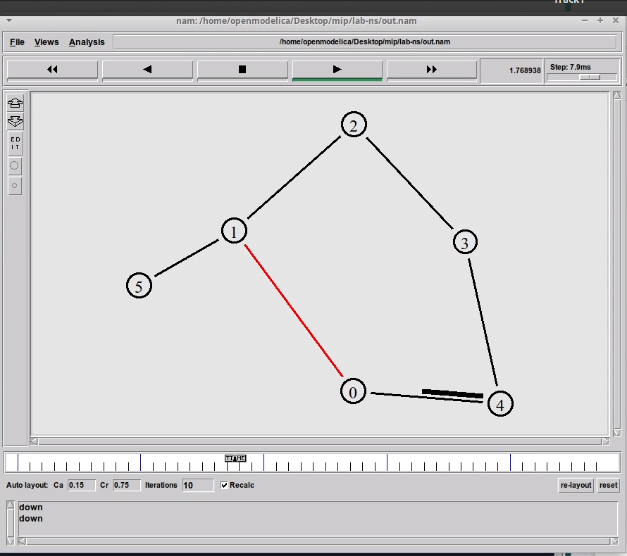

---
## Front matter
lang: ru-RU
title: Лабораторная работа 1. Простые модели компьютерной сети
author:
  - Мугари Абдеррахим
institute:
  - Российский университет дружбы народов, Москва, Россия
  - Факультет физико-математических и естественных наук
date: 15 февраля 2025 

## i18n babel
babel-lang: russian
babel-otherlangs: english

## Formatting pdf
toc: false
toc-title: Содержание
slide_level: 2
aspectratio: 169
section-titles: true
theme: metropolis
header-includes:
 - \metroset{progressbar=frametitle,sectionpage=progressbar,numbering=fraction}
---

# Информация

## Докладчик

:::::::::::::: {.columns align=center}
::: {.column width="70%"}

  * Мугари Абдеррахим
  * Студент третьего курса
  * Российский университет дружбы народов
  * [1032215692@rudn.ru](mailto:1032215692@rudn.r)
  * <https://iragoum.github.io/ru/>

:::
::: {.column width="30%"}

:::
::::::::::::::

# Цель работы

- Приобретение навыков моделирования сетей передачи данных с помощью средства имитационного моделирования NS-2, а также анализ полученных результатов
моделирования

# Материалы и методы

- NS-2.
- nam.
- xUbuntu.

# Ход работы:

## Пример 1: Простая сеть из двух узлов (UDP, CBR)
- Создали 2 узла
- Cоединили их дуплексным каналом (2 Мбит/с, 10 мс)
- Настроили UDP-агент и CBR-трафик (500 байт, 200 пакетов/сек)
- Добавили приемник Null на втором узле
- Визуализировали результат в NAM

## Пример 1: Простая сеть из двух узлов (UDP, CBR)
{#fig:001 width=70%}

## Пример 1: Простая сеть из двух узлов (UDP, CBR)
{#fig:002 width=40%}

## Пример 1: Простая сеть из двух узлов (UDP, CBR)

{#fig:003 width=40%}

## Пример 1: Простая сеть из двух узлов (UDP, CBR)

Вывод: научились основам NS-2 – созданию узлов, соединений и запуску трафика.

## Пример 2: Сеть из 4 узлов (TCP, UDP, FTP)

- Добавили 4 узла и связали их разными каналами
- Настроили UDP и TCP трафик одновременно
- Подключили CBR к UDP и FTP к TCP
- Ограничили размер очереди
- Наблюдали влияние перегрузки сети в NAM

## Пример 2: Сеть из 4 узлов (TCP, UDP, FTP)

{#fig:004 width=40%}

## Пример 2: Сеть из 4 узлов (TCP, UDP, FTP)

- Вывод: изучили одновременную работу разных типов трафика и анализировали пропускную способность.

## Пример 3: Кольцевая топология (7 узлов, динамическая маршрутизация)
- Создали кольцевую сеть из 7 узлов
- Использовали протокол маршрутизации DV
- Передавали данные по кратчайшему маршруту
- Имитировали разрыв соединения (1–2 сек)
- Анализировали изменение маршрута в реальном времени

## Пример 3: Кольцевая топология (7 узлов, динамическая маршрутизация)

{#fig:005 width=40%}

## Пример 3: Кольцевая топология (7 узлов, динамическая маршрутизация)

- Вывод: увидели, как сеть динамически изменяет маршрут при изменении топологии.

## Упражнение: Модифицированная топология с разрывом связи (5+1 узлов)
- Создали 5 узлов в кольце + доп. узел n(5)
- Соединили n(5) с n(1) дополнительным каналом
- Передавали TCP (Newreno) → TCPSink (DelAck)
- Разорвали n(0) – n(1) с 1 по 2 секунду
- После восстановления трафик вернулся на кратчайший маршрут

## Упражнение: Модифицированная топология с разрывом связи (5+1 узлов)

{#fig:006 width=40%}

## Упражнение: Модифицированная топология с разрывом связи (5+1 узлов)
- Вывод: увидели, как сеть динамически изменяет маршрут при изменении топологии.

# Вывод:

- Лабораторная работа №1 позволила освоить:
    - Основные возможности NS-2
    - Создание разных топологий сети
    - Работу с различными протоколами (UDP, TCP, FTP, CBR)
    - Динамическую маршрутизацию и поведение сети при сбоях
    - Визуализацию трафика с помощью NAM
