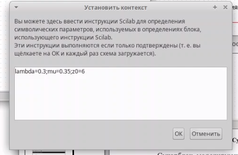
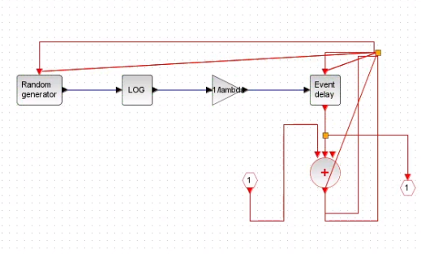
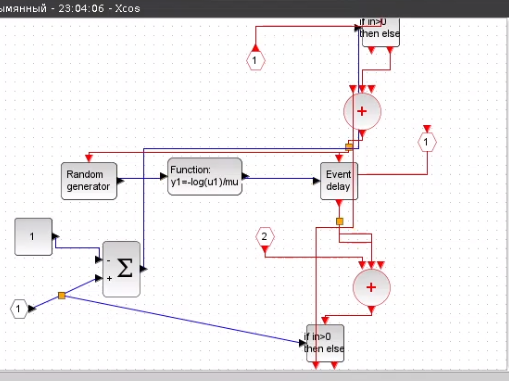
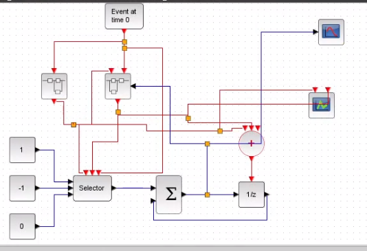
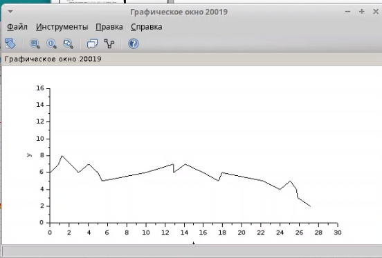
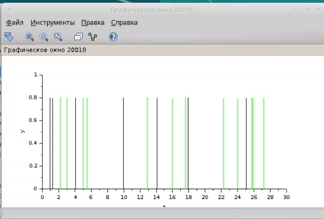

---
## Front matter
lang: ru-RU
title: Лабораторная работа № 7
subtitle: Модель M |M |1|∞
author:
  - Мугари Абдеррахим
institute:
  - Российский университет дружбы народов, Москва, Россия
date: 22 марта 2025

## i18n babel
babel-lang: russian
babel-otherlangs: english

## Formatting pdf
toc: false
toc-title: Содержание
slide_level: 2
aspectratio: 169
section-titles: true
theme: metropolis
header-includes:
 - \metroset{progressbar=frametitle,sectionpage=progressbar,numbering=fraction}
---

# Информация

## Преподаватель 

:::::::::::::: {.columns align=center}
::: {.column width="70%"}

  * Анна Владиславовна Королькова
  * доцент кафедры прикладной информатики и теории вероятностей РУДН; 
  * заведующий лабораторией кафедры прикладной информатики и теории вероятностей РУДН (по совместительству); 
  *  программист I кат. 
  * Российский университет дружбы народов
  * [korolkova-av@rudn.ru](mailto:korolkova-av@rudn.ru)

:::
::: {.column width="30%"}

:::
::::::::::::::

## Докладчик

:::::::::::::: {.columns align=center}
::: {.column width="70%"}

  * Мугари Абдеррахим
  * Студент третьего курса 
  * фундаментальная информатика и информационные технологии
  * Российский университет дружбы народов
  * [1032215692@rudn.ru](mailto:1032215692@rudn.ru)
  * <https://iragoum.github.io/>

:::
::: {.column width="30%"}

:::
::::::::::::::

# Лабораторная работа: Моделирование системы массового обслуживания M/M/1/∞ в Xcos

## Исходные данные
Заданные параметры модели:
- Интенсивность поступления заявок: \\($\lambda = 0.3$\\)
- Интенсивность обслуживания: \\($\mu = 0.35$\\)
- Начальный размер очереди: \\(z_0 = 6\\)

Через меню *Моделирование → Установить контекст* в Xcos были заданы значения переменных 

{#fig:001 width=40%}

## Описание модели

1. Суперблок генерации заявок
Реализует пуассоновский процесс поступления заявок 
- Источник событий генерирует сигналы.
- Синхронизатор обрабатывает входные/выходные сигналы.
- Равномерное распределение на интервале \\([0;1]\\) преобразуется в экспоненциальное с параметром \\($\lambda$\\).
- Обработчик событий направляет заявки в очередь.

{#fig:002 width=30%}

## Описание модели

2. Суперблок обработки заявок
Моделирует обслуживание заявок 
- Экспоненциальное распределение с параметром \\($\mu$\\).
- Учет дисциплины обслуживания FIFO (First-In-First-Out).

{#fig:003 width=35%}

## Описание модели

3. Итоговая модель
Система M/M/1/∞ в Xcos включает 
- Селектор для управления потоками.
- Оператор задержки для имитации очереди.
- Регистраторы: 
  - Динамики размера очереди.
  - Событий поступления/обработки заявок..

{#fig:004 width=35%}

# Результаты моделирования
1. **Динамика очереди**  начинается с \\($z_0 = 6$\\), что соответствует начальным условиям.
2. **График событий** . отражает пуассоновский входной поток и экспоненциальное обслуживание.

## Динамика размера очереди

{#fig:005 width=60%}

## События поступления и обработки

{#fig:006 width=60%}

## Вывод
В ходе работы:
- Реализована модель СМО типа M/M/1/∞ в Xcos.
- Проверена корректность начальных условий (\\(z_0 = 6\\)).
- Получены графики, подтверждающие соответствие модели теоретическим характеристикам систем массового обслуживания.

