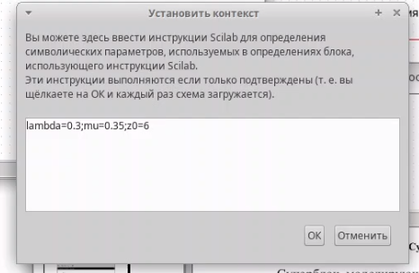
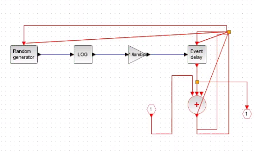
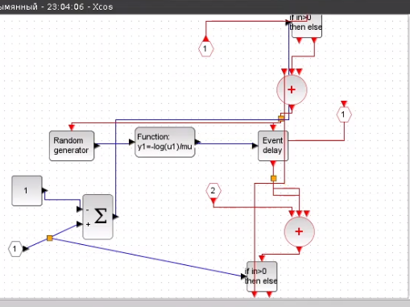
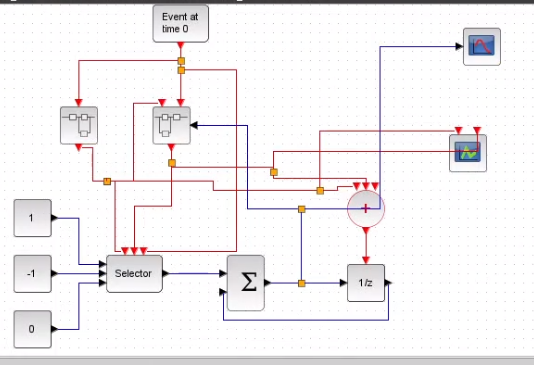
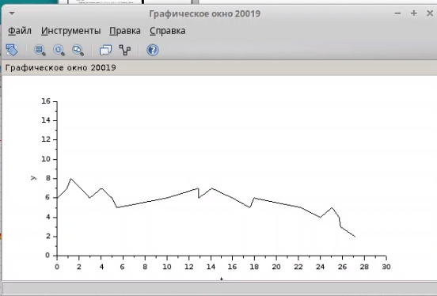
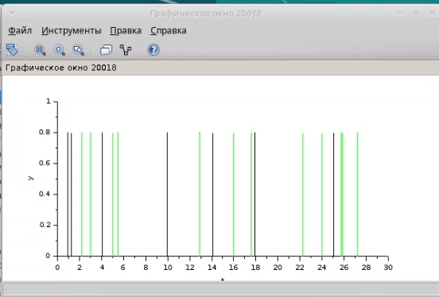

---
## Front matter
title: "Лабораторная работа 7"
subtitle: "Модель M |M |1|∞"
author: "Мугари Абдеррахим"

## Generic options
lang: ru-RU
toc-title: "Содержание"

## Bibliography
bibliography: bib/cite.bib
csl: pandoc/csl/gost-r-7-0-5-2008-numeric.csl

## Pdf output format
toc: true # Table of contents
toc-depth: 2
lof: true # List of figures
lot: true # List of tables
fontsize: 13pt
linestretch: 1.5
papersize: a4
documentclass: scrreprt
## I18n polyglossia
polyglossia-lang:
  name: russian
  options:
    - spelling=modern
    - babelshorthands=true
polyglossia-otherlangs:
  name: english
## I18n babel
babel-lang: russian
babel-otherlangs: english
## Fonts
mainfont: Times New Roman
romanfont: Times New Roman
sansfont: Times New Roman
monofont: "Courier New"
mathfont: STIX Two Math
mainfontoptions: Scale=1.0
romanfontoptions: Scale=1.0
sansfontoptions: Scale=1.0
monofontoptions: Scale=1.0,FakeStretch=0.9
mathfontoptions:
## Biblatex
biblatex: true
biblio-style: "gost-numeric"
biblatexoptions:
  - parentracker=true
  - backend=biber
  - hyperref=auto
  - language=auto
  - autolang=other*
  - citestyle=gost-numeric
## Pandoc-crossref LaTeX customization
figureTitle: "Рис."	
tableTitle: "Таблица"
listingTitle: "Листинг"
lofTitle: "Список иллюстраций"
lotTitle: "Список таблиц"
lolTitle: "Листинги"
## Misc options
indent: true
header-includes:
  - \usepackage{listings}
  - \renewcommand{\lstlistingname}{Листинг}
  - \usepackage{indentfirst}
  - \usepackage{float} # keep figures where there are in the text
  - \floatplacement{figure}{H} # keep figures where there are in the text
  - \renewcommand{\familydefault}{\rmdefault} # Ensure Times New Roman for main text
  - \lstset{basicstyle=\ttfamily\fontsize{10pt}{10pt}\selectfont,lineskip=-1pt} 

---

# Лабораторная работа: Моделирование системы массового обслуживания M/M/1/∞ в Xcos

## Исходные данные
Заданные параметры модели:
- Интенсивность поступления заявок: \\($\lambda = 0.3$\\)
- Интенсивность обслуживания: \\($\mu = 0.35$\\)
- Начальный размер очереди: \\(z_0 = 6\\)

Через меню *Моделирование → Установить контекст* в Xcos были заданы значения переменных (см. рис. [-@fig:001])..

{#fig:001 width=70%}

## Описание модели

### 1. Суперблок генерации заявок
Реализует пуассоновский процесс поступления заявок (см. рис. [-@fig:002]).:
- Источник событий генерирует сигналы.
- Синхронизатор обрабатывает входные/выходные сигналы.
- Равномерное распределение на интервале \\([0;1]\\) преобразуется в экспоненциальное с параметром \\($\lambda$\\).
- Обработчик событий направляет заявки в очередь.

{#fig:002 width=70%}

### 2. Суперблок обработки заявок
Моделирует обслуживание заявок (см. рис. [-@fig:003]).:
- Экспоненциальное распределение с параметром \\($\mu$\\).
- Учет дисциплины обслуживания FIFO (First-In-First-Out).

{#fig:003 width=70%}

### Итоговая модель
Система M/M/1/∞ в Xcos включает (см. рис. [-@fig:004]).:
- Селектор для управления потоками.
- Оператор задержки для имитации очереди.
- Регистраторы: 
  - Динамики размера очереди.
  - Событий поступления/обработки заявок..

{#fig:004 width=70%}

## Результаты моделирования
1. **Динамика очереди** (см. рис. [-@fig:005]). начинается с \\($z_0 = 6$\\), что соответствует начальным условиям.
2. **График событий** (см. рис. [-@fig:006]). отражает пуассоновский входной поток и экспоненциальное обслуживание.

{#fig:005 width=70%}

{#fig:006 width=70%}

## Вывод
В ходе работы:
- Реализована модель СМО типа M/M/1/∞ в Xcos.
- Проверена корректность начальных условий (\\(z_0 = 6\\)).
- Получены графики, подтверждающие соответствие модели теоретическим характеристикам систем массового обслуживания.

Подробнее см. в [@kleinrock1975queueing; @law2015simulation]

# Список литературы{.unnumbered}

::: {#refs}
:::

