---
## Front matter
lang: ru-RU
title: Лабораторная работа № 8
subtitle: Модель TCP/AQM
author:
  - Мугари Абдеррахим
institute:
  - Российский университет дружбы народов, Москва, Россия
date: 29 марта 2025

## i18n babel
babel-lang: russian
babel-otherlangs: english

## Formatting pdf
toc: false
toc-title: Содержание
slide_level: 2
aspectratio: 169
section-titles: true
theme: metropolis
header-includes:
 - \metroset{progressbar=frametitle,sectionpage=progressbar,numbering=fraction}
---

# Информация

## Преподаватель 

:::::::::::::: {.columns align=center}
::: {.column width="70%"}

  * Анна Владиславовна Королькова
  * доцент кафедры прикладной информатики и теории вероятностей РУДН; 
  * заведующий лабораторией кафедры прикладной информатики и теории вероятностей РУДН (по совместительству); 
  *  программист I кат. 
  * Российский университет дружбы народов
  * [korolkova-av@rudn.ru](mailto:korolkova-av@rudn.ru)

:::
::: {.column width="30%"}

:::
::::::::::::::

## Докладчик

:::::::::::::: {.columns align=center}
::: {.column width="70%"}

  * Мугари Абдеррахим
  * Студент третьего курса 
  * фундаментальная информатика и информационные технологии
  * Российский университет дружбы народов
  * [1032215692@rudn.ru](mailto:1032215692@rudn.ru)
  * <https://iragoum.github.io/>

:::
::: {.column width="30%"}

:::
::::::::::::::

# Цель работы

Основной задачей данной лабораторной работы является реализация модели TCP/AQM с использованием инструментов xcos и OpenModelica.

# Задание

- Разработать модель TCP/AQM в средах xcos и OpenModelica.
- Построить график, демонстрирующий динамику изменения очереди и TCP-окна.
- Построить фазовый портрет, отображающий взаимосвязь между размером очереди и TCP-окном.

# Теоретическое введение

Рассмотрим упрощённую модель поведения TCP-подобного трафика с регулируемой
некоторым AQM алгоритмом динамической интенсивностью потока. 

# Упрощённая модель TCP/AQM

**Переменные:**
- $W(t)$ – средний размер TCP-окна (в пакетах)
- $Q(t)$ – средний размер очереди (в пакетах)
- $R$ – время двойного оборота (RTT, сек.)
- $C$ – скорость обработки пакетов (пакетов/сек.)
- $N$ – число TCP-сессий
- $p(t-R) = KQ(t)$ – вероятность сброса пакета

**Система уравнений:**
$$
\dot{W}(t) = \frac{1}{R} - \frac{W(t)W(t-R)}{2R} K Q(t-R)
$$

$$
\dot{Q}(t) = 
\begin{cases} 
    \frac{NW(t)}{R} - C, & Q(t) > 0, \\
    \max \left( \frac{NW(t)}{R} - C, 0 \right), & Q(t) = 0.
\end{cases}
$$

# Выполнение лабораторной работы

# Реализация в xcos

## Настройка переменных окружения
Сначала определим переменные окружения: $N = 1, R = 1, K = 5.3, C = 1, W(0) = 0.1, Q(0) = 1$.

Для этого сначала определяем переменные окружения. 

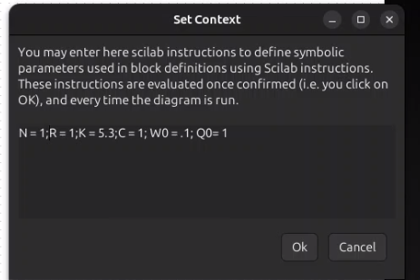{#fig:001 width=40%}

## Параметры моделирования

Так же устанавливаем время моделирования (100 единиц времени).

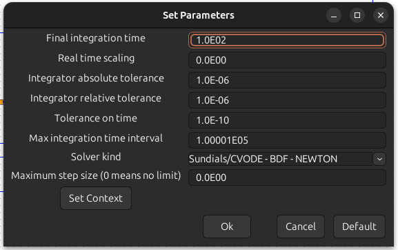{#fig:002 width=40%}

## Начальные условия интеграторов

Зададим стартовые значения для интеграторов 

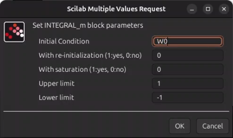{#fig:003 width=40%}

## Начальные условия интеграторов

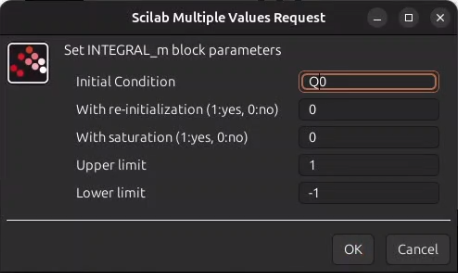{#fig:004 width=40%}

## Настройка задержки

Определим параметр задержки 

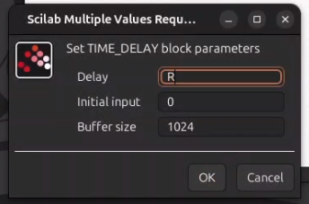{#fig:005 width=40%}

## Выражение для производной очереди

В блоке Expression вводим формулу для $\dot{Q}(t)$

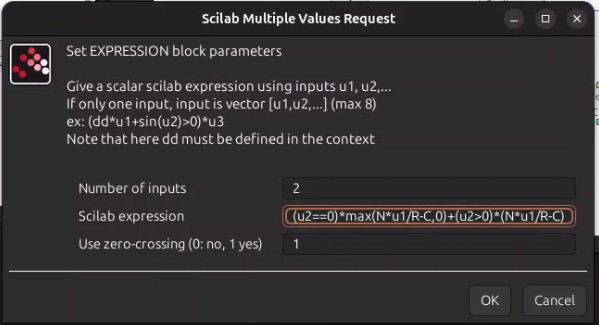{#fig:006 width=40%}

## Настройка регистрирующих модулей

Для корректного отображения графиков устанавливаем параметры регистрирующих устройств. В частности, в блоке CSCOPE задаем значение `refresh period` = 100, что позволяет отображать результаты моделирования за 100 секунд модельного времени.

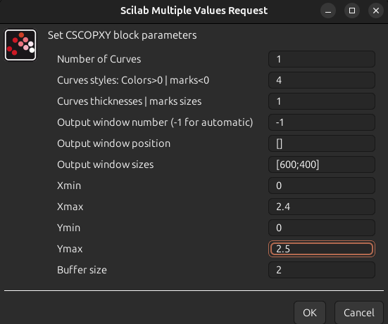{#fig:007 width=40%}

## Настройка регистрирующих модулей

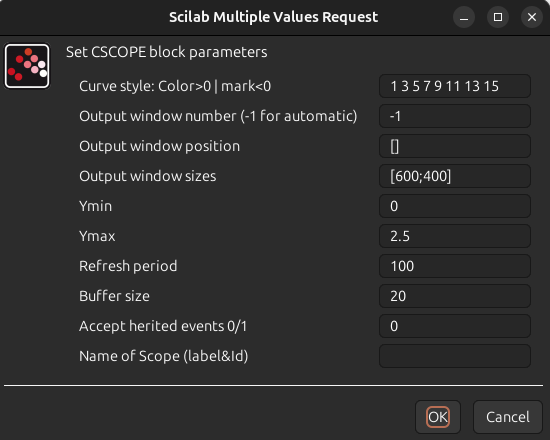{#fig:008 width=40%}

## Сборка схемы модели TCP/AQM:

Реализуем модель TCP/AQM, подключив регистрирующие блоки CSCOPE для отображения графиков изменения TCP-окна и очереди, а также блок CSCOPXY для построения фазового портрета

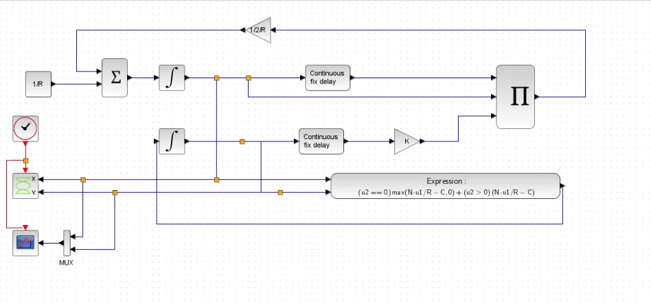{#fig:009 width=70%}

## Графики моделирования
В результате получаем следующие графики: 
- Динамика изменения размера TCP-окна $W(t)$ (отмечена зелёной линией) и очереди $Q(t)$ (чёрная линия)

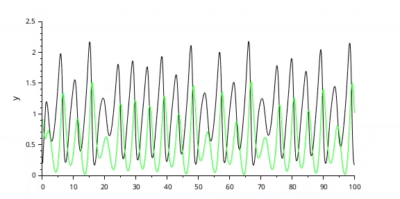{#fig:010 width=70%}

## Графики моделирования

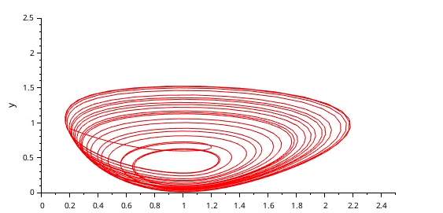{#fig:011 width=60%}

## Влияние изменения параметров
При уменьшении значения скорости обработки пакетов $C$ до 0.9 наблюдаются более выраженные автоколебания, что видно по графикам:

- Динамика TCP-окна $W(t)$ и очереди $Q(t)$ при $C = 0.9$
- Фазовый портрет системы при $C$ = 0.9

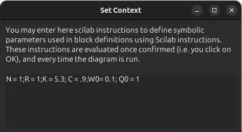{#fig:012 width=40%}

## Влияние изменения параметров

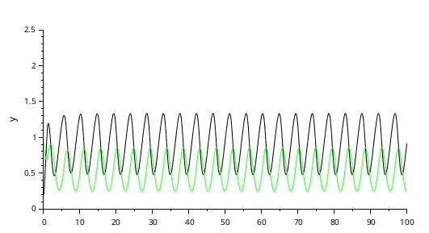{#fig:013 width=60%}

## Влияние изменения параметров

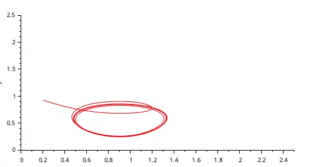{#fig:014 width=60%}

# Реализация модели в OpenModelica

## Настройка модели

Перейдем к реализации модели в OpenModelica. Зададим параметры, начальные значения и систему дифференциальных уравнений

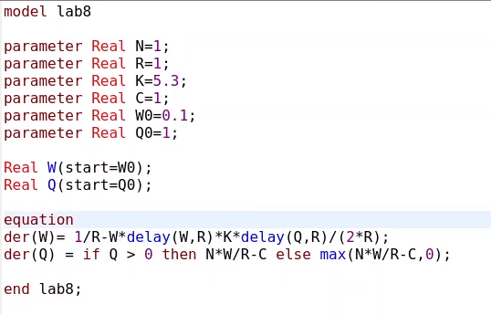{#fig:015 width=40%}

## Параметры симуляции

Устанавливаем время симуляции равным 100 единицам модельного времени 

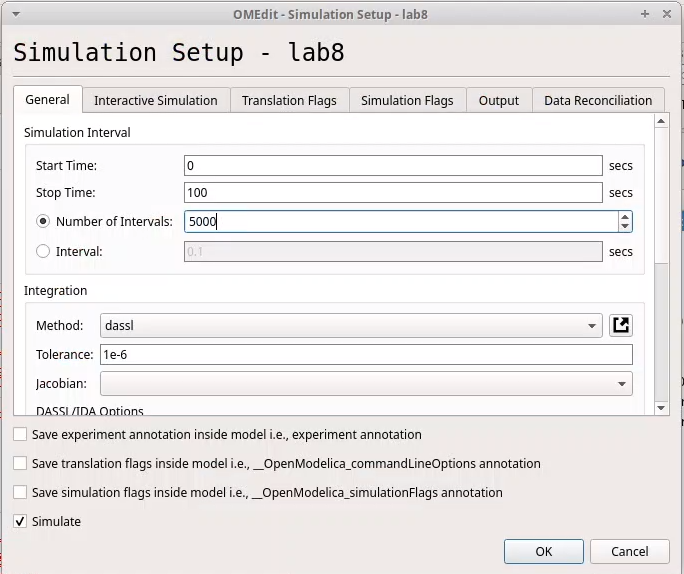{#fig:016 width=40%}

## Графики результатов*

Полученные результаты демонстрируют:
   - Динамику изменения размера TCP-окна. $W(t)$ (красная линия) и очереди $Q(t)$ (синяя линия) 
   - Фазовый портрет, подтверждающий наличие автоколебаний, где фазовая траектория осциллирует вокруг стационарной точки

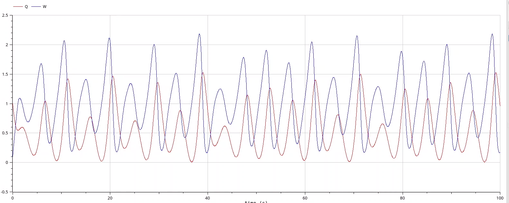{#fig:017 width=50%}

## Графики результатов*

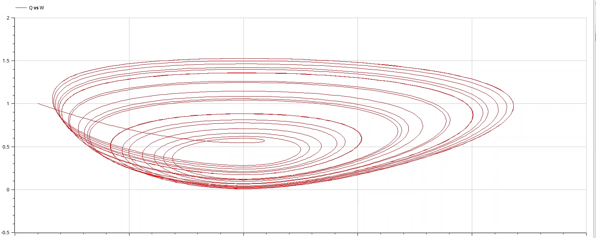{#fig:018 width=60%}

## Изменение параметра в OpenModelica

Изменяем скорость обработки пакетов $C$ до 0.9 
Результаты показывают, что автоколебания стали более выраженными, что видно по графикам: 
   - Динамика TCP-окна и очереди при $C$ = 0.9 
   - Фазовый портрет при $C$ = 0.9 

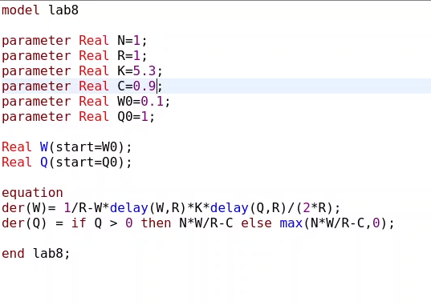{#fig:019 width=40%}

Точно так же увидим, что автоколебания стали более выраженными 

## Изменение параметра в OpenModelica

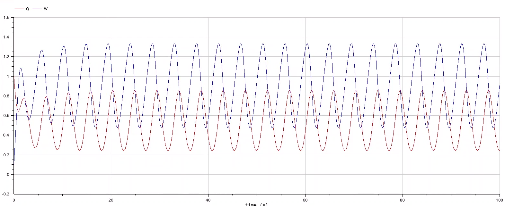{#fig:020 width=60%}

## Изменение параметра в OpenModelica

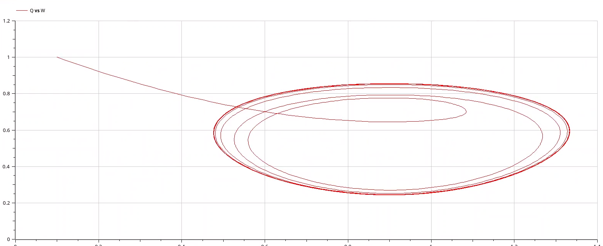{#fig:021 width=60%}

# Выводы:

В результате выполнения лабораторной работы была успешно разработана и реализована модель TCP/AQM с использованием инструментов xcos и OpenModelica. Анализ графиков показал наличие автоколебаний в системе, которые усиливаются при уменьшении скорости обработки пакетов $C$
