---
## Front matter
title: "Изучение модели TCP/AQM в сетевых системах"
subtitle: "Анализ управления очередями в TCP"
author: "Мугари Абдеррахим"

## Generic otions
lang: ru-RU
toc-title: "Изучение модели TCP/AQM в сетевых системах"

## Bibliography
bibliography: bib/cite.bib
csl: pandoc/csl/gost-r-7-0-5-2008-numeric.csl

## Pdf output format
toc: true # Table of contents
toc-depth: 2
lof: true # List of figures
lot: false # List of tables
fontsize: 12pt
linestretch: 1.5
papersize: a4
documentclass: scrreprt
## I18n polyglossia
polyglossia-lang:
  name: russian
  options:
	- spelling=modern
	- babelshorthands=true
polyglossia-otherlangs:
  name: english
## I18n babel
babel-lang: russian
babel-otherlangs: english
## Fonts
mainfont: IBM Plex Serif
romanfont: IBM Plex Serif
sansfont: IBM Plex Sans
monofont: IBM Plex Mono
mathfont: STIX Two Math
mainfontoptions: Ligatures=Common,Ligatures=TeX,Scale=0.94
romanfontoptions: Ligatures=Common,Ligatures=TeX,Scale=0.94
sansfontoptions: Ligatures=Common,Ligatures=TeX,Scale=MatchLowercase,Scale=0.94
monofontoptions: Scale=MatchLowercase,Scale=0.94,FakeStretch=0.9
mathfontoptions:
## Biblatex
biblatex: true
biblio-style: "gost-numeric"
biblatexoptions:
  - parentracker=true
  - backend=biber
  - hyperref=auto
  - language=auto
  - autolang=other*
  - citestyle=gost-numeric
## Pandoc-crossref LaTeX customization
figureTitle: "Рис."
tableTitle: "Таблица"
listingTitle: "Листинг"
lofTitle: "Список иллюстраций"
lotTitle: "Список таблиц"
lolTitle: "Листинги"
## Misc options
indent: true
header-includes:
  - \usepackage{indentfirst}
  - \usepackage{float} # keep figures where there are in the text
  - \floatplacement{figure}{H} # keep figures where there are in the text
---

# Цель работы

Основной задачей данной лабораторной работы является реализация модели TCP/AQM с использованием инструментов xcos и OpenModelica.

# Задание

- Разработать модель TCP/AQM в средах xcos [@xcos:bash] и OpenModelica.
- Построить график, демонстрирующий динамику изменения очереди и TCP-окна.
- Построить фазовый портрет, отображающий взаимосвязь между размером очереди и TCP-окном.

# Теоретическое введение

Рассмотрим упрощённую модель поведения TCP-подобного трафика с регулируемой
некоторым AQM алгоритмом динамической интенсивностью потока [@l:bash].. 

$W(t)$ - средний размер TCP-окна (в пакетах, функция положительна),

$Q(t)$ - средний размер очереди (в пакетах, функция положительна),

$R(t)$ - время двойного оборота (Round Trip Time, сек.)

$C$ - скорость обработки пакетов в очереди (пакетов в секунду)

$N(t)$ - число TCP-сессий

$p(t-R(t))$ - вероятностная функция сброса (отметки на сброс) пакета, значения которой лежат на интервале $[0,1]$.

Примем $N(t) \equiv N$, $R(t) \equiv R$, т. е. указанные величины положим постоянными, не изменяющимися во времени. Также положим $p(t-R(t))=KQ(t)$, т.е. функция сброса пакетов пропорциональна длине очереди $Q(t)$. 

Тогда получим систему 

$$
\dot{W}(t) = \frac{1}{R} - \frac{W(t)W(t-R)}{2R} K Q(t-R)
$${#eq:eq:W}

$$
\dot{Q}(t) = 
\begin{cases} 
    \frac{NW(t)}{R} - C, & Q(t) > 0, \\
    \max \left( \frac{NW(t)}{R} - C, 0 \right), & Q(t) = 0.
\end{cases}
$${#eq:eq:Q}

# Выполнение лабораторной работы

## Реализация в xcos

## Настройка переменных окружения
Сначала определим переменные окружения: $N = 1, R = 1, K = 5.3, C = 1, W(0) = 0.1, Q(0) = 1$.

Для этого сначала определяем переменные окружения. (рис. [-@fig:001]).

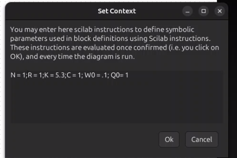{#fig:001 width=70%}

## Параметры моделирования

Так же устанавливаем время моделирования (100 единиц времени). (рис. [-@fig:002]).

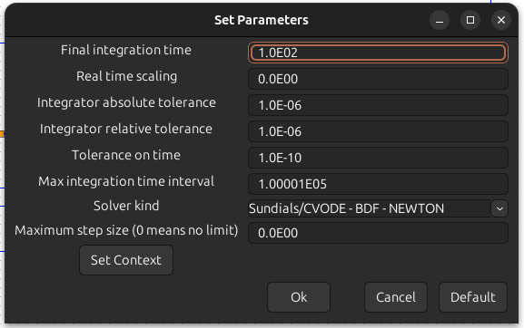{#fig:002 width=70%}

## Начальные условия интеграторов

Зададим стартовые значения для интеграторов (рис. [-@fig:003], [-@fig:004]).

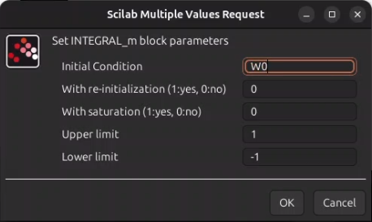{#fig:003 width=70%}

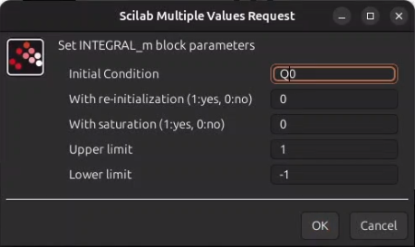{#fig:004 width=70%}

## Настройка задержки

Определим параметр задержки (рис. [-@fig:005]).

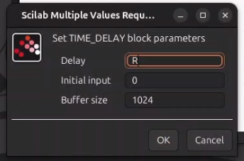{#fig:005 width=70%}

## Выражение для производной очереди

В блоке Expression вводим формулу для $\dot{Q}(t)$ (рис. [-@fig:006]).

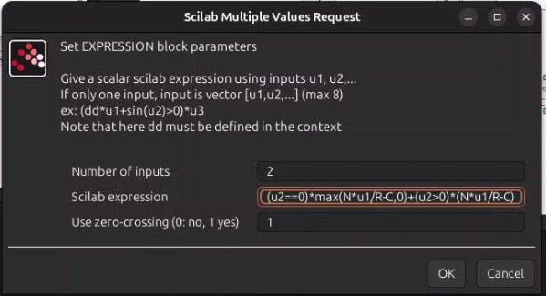{#fig:006 width=70%}

## Настройка регистрирующих модулей

Для корректного отображения графиков устанавливаем параметры регистрирующих устройств. В частности, в блоке CSCOPE задаем значение `refresh period` = 100, что позволяет отображать результаты моделирования за 100 секунд модельного времени (рис. [-@fig:007], [-@fig:008]).

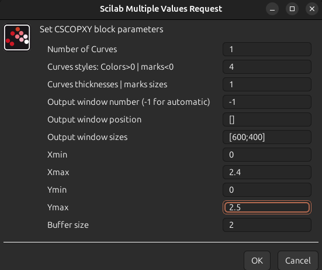{#fig:007 width=70%}

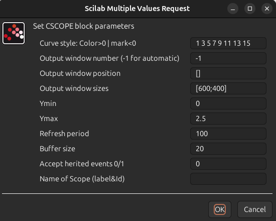{#fig:008 width=70%}

## Сборка схемы модели TCP/AQM:

Реализуем модель TCP/AQM [@tcp:control], подключив регистрирующие блоки CSCOPE для отображения графиков изменения TCP-окна и очереди, а также блок CSCOPXY для построения фазового портрета (рис. [-@fig:009]).

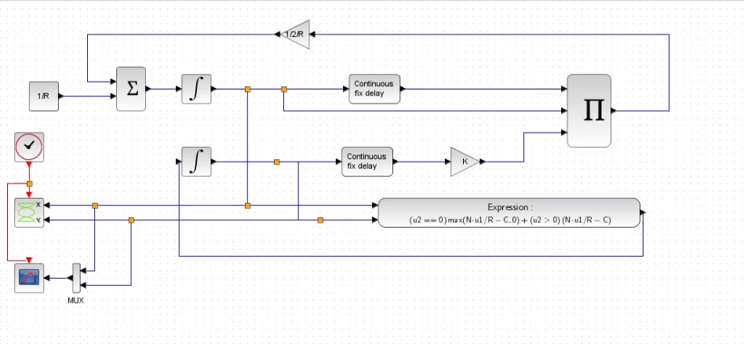{#fig:009 width=70%}

## Графики моделирования
В результате получаем следующие графики: 
- Динамика изменения размера TCP-окна $W(t)$ (отмечена зелёной линией) и очереди $Q(t)$ (чёрная линия) (рис. [-@fig:010], [-@fig:011])

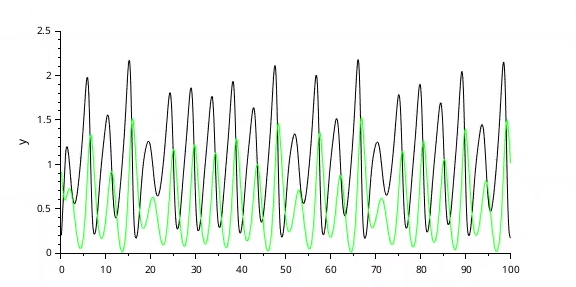{#fig:010 width=70%}

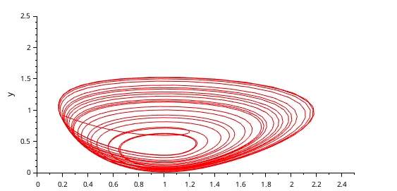{#fig:011 width=70%}

## Влияние изменения параметров
При уменьшении значения скорости обработки пакетов $C$ до 0.9 наблюдаются более выраженные автоколебания, что видно по графикам:

- Динамика TCP-окна $W(t)$ и очереди $Q(t)$ при $C = 0.9$ (рис. [-@fig:012]) 
- Фазовый портрет системы при $C$ = 0.9 (рис. [-@fig:013])

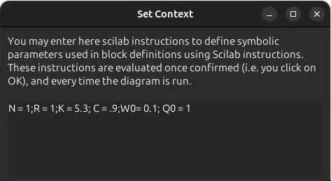{#fig:012 width=70%}

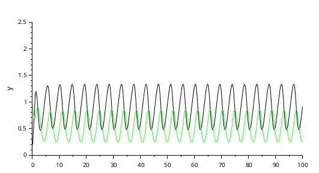{#fig:013 width=70%}

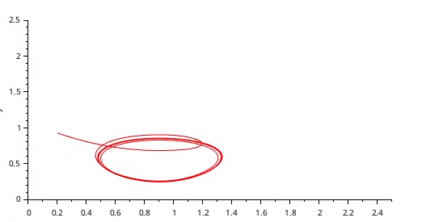{#fig:014 width=70%}

## Реализация модели в OpenModelica

## Настройка модели

Перейдем к реализации модели в OpenModelica [@modelica:guide]. Зададим параметры, начальные значения и систему дифференциальных уравнений (рис. [-@fig:015]).

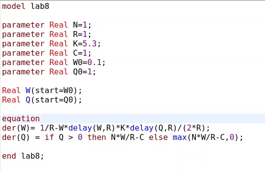{#fig:015 width=70%}

## Параметры симуляции

Устанавливаем время симуляции равным 100 единицам модельного времени (рис. [-@fig:016]).

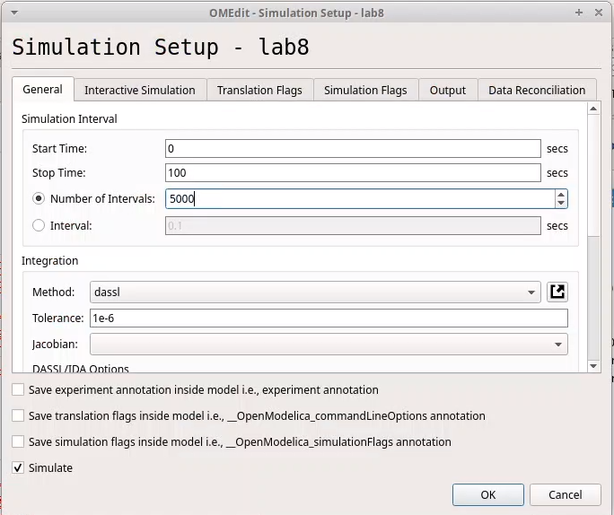{#fig:016 width=70%}

## Графики результатов*

Полученные результаты демонстрируют:
   - Динамику изменения размера TCP-окна [@l:bash]. $W(t)$ (красная линия) и очереди $Q(t)$ (синяя линия)  (рис. [-@fig:017]).
   - Фазовый портрет, подтверждающий наличие автоколебаний, где фазовая траектория осциллирует вокруг стационарной точки  (рис. [-@fig:018]).

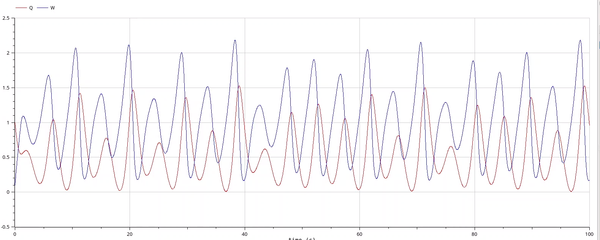{#fig:017 width=70%}

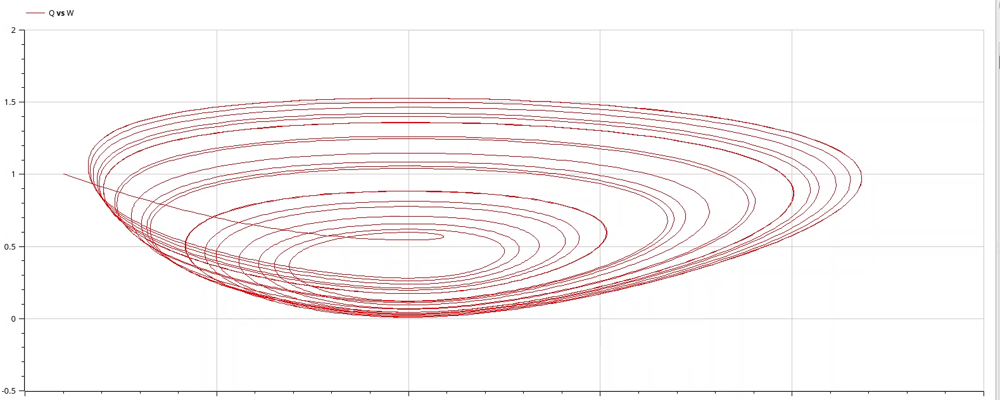{#fig:018 width=70%}

## Изменение параметра в OpenModelica

Изменяем скорость обработки пакетов $C$ до 0.9 
Результаты показывают, что автоколебания стали более выраженными, что видно по графикам: 
   - Динамика TCP-окна и очереди при $C$ = 0.9  (рис. [-@fig:019]).
   - Фазовый портрет при $C$ = 0.9  (рис. [-@fig:020]).

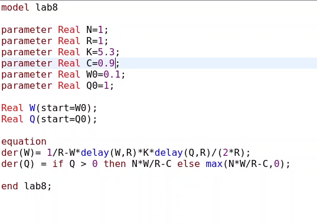{#fig:019 width=70%}

Точно так же увидим, что автоколебания стали более выраженными (рис. [-@fig:020], [-@fig:021]).

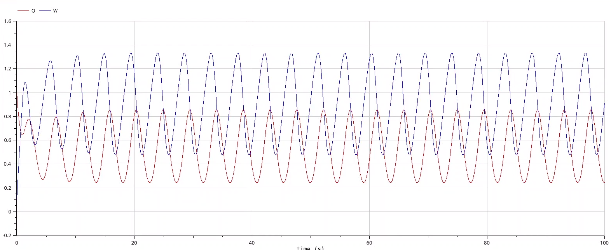{#fig:020 width=70%}

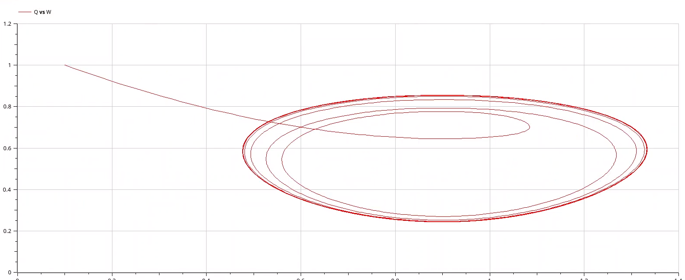{#fig:021 width=70%}

# Выводы:

В результате выполнения лабораторной работы была успешно разработана и реализована модель TCP/AQM с использованием инструментов xcos и OpenModelica. Анализ графиков показал наличие автоколебаний в системе, которые усиливаются при уменьшении скорости обработки пакетов $C$

# Список литературы{.unnumbered}

::: {#refs}
:::

