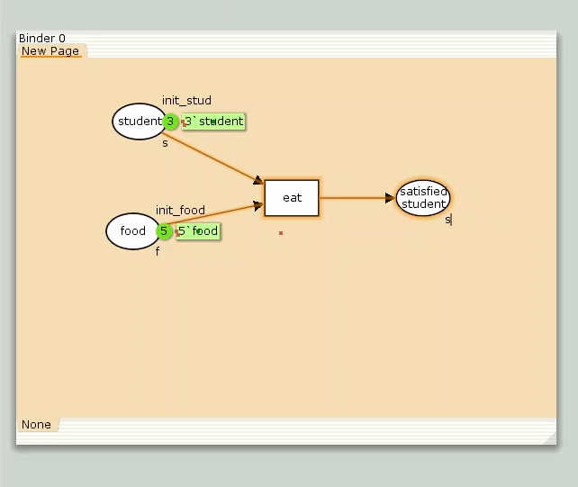
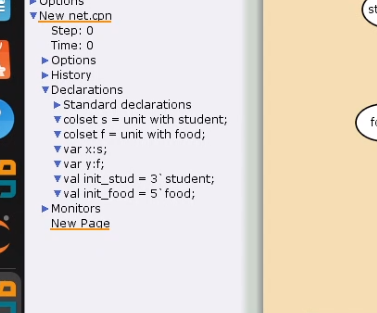
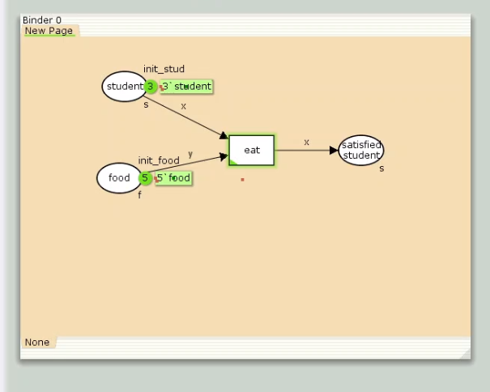
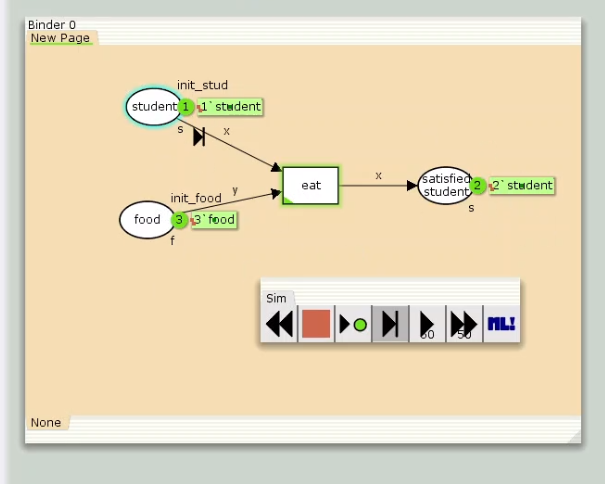
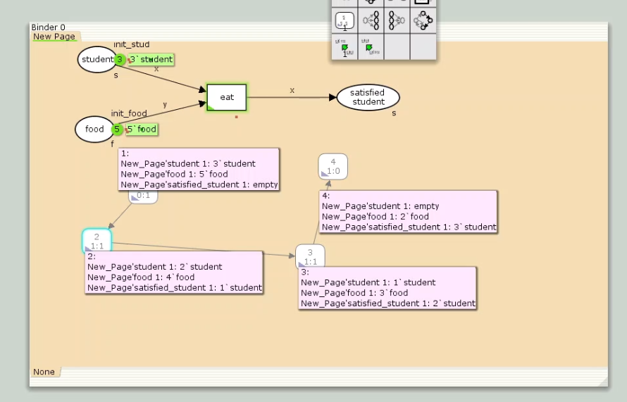

---
## Front matter
title: "Лабораторная работа № 9"
subtitle: "Модель «Накорми студентов»"
author: "Мугари Абдеррахим"

## Generic otions
lang: ru-RU
toc-title: "Содержание"

## Bibliography
bibliography: bib/cite.bib
csl: pandoc/csl/gost-r-7-0-5-2008-numeric.csl

## Pdf output format
toc: true # Table of contents
toc-depth: 2
lof: true # List of figures
lot: false # List of tables
fontsize: 12pt
linestretch: 1.5
papersize: a4
documentclass: scrreprt
## I18n polyglossia
polyglossia-lang:
  name: russian
  options:
	- spelling=modern
	- babelshorthands=true
polyglossia-otherlangs:
  name: english
## I18n babel
babel-lang: russian
babel-otherlangs: english
## Fonts
mainfont: IBM Plex Serif
romanfont: IBM Plex Serif
sansfont: IBM Plex Sans
monofont: IBM Plex Mono
mathfont: STIX Two Math
mainfontoptions: Ligatures=Common,Ligatures=TeX,Scale=0.94
romanfontoptions: Ligatures=Common,Ligatures=TeX,Scale=0.94
sansfontoptions: Ligatures=Common,Ligatures=TeX,Scale=MatchLowercase,Scale=0.94
monofontoptions: Scale=MatchLowercase,Scale=0.94,FakeStretch=0.9
mathfontoptions:
## Biblatex
biblatex: true
biblio-style: "gost-numeric"
biblatexoptions:
  - parentracker=true
  - backend=biber
  - hyperref=auto
  - language=auto
  - autolang=other*
  - citestyle=gost-numeric
## Pandoc-crossref LaTeX customization
figureTitle: "Рис."
tableTitle: "Таблица"
listingTitle: "Листинг"
lofTitle: "Список иллюстраций"
lotTitle: "Список таблиц"
lolTitle: "Листинги"
## Misc options
indent: true
header-includes:
  - \usepackage{indentfirst}
  - \usepackage{float} # keep figures where there are in the text
  - \floatplacement{figure}{H} # keep figures where there are in the text
---


## Цель работы

Цель данной лабораторной работы — разработать модель "Накорми студентов" с применением среды CPN Tools.

**Задание**

- Смоделировать в CPN Tools процесс "Накормить студентов".
- Вычислить пространство состояний модели, подготовить соответствующий отчет и визуализировать граф.

# Теоретическое введение

CPN Tools — это специализированная программа для моделирования иерархических временных раскрашенных сетей Петри. Эти сети обладают вычислительной мощностью, эквивалентной машине Тьюринга, и представляют собой универсальную алгоритмическую систему, позволяющую описывать любые процессы [@cpn:bash].

С помощью CPN Tools можно визуализировать модель через граф сети Петри, а также использовать язык программирования CPN ML (Colored Petri Net Markup Language) для формального описания логики модели.

Основные возможности CPN Tools:

- проектирование сложных моделей и моделирование процессов в различных прикладных сферах, включая:

- моделирование производственных процессов и бизнес-процессов;

- моделирование систем управления производством и робототехникой;

- спецификация и верификация сетевых протоколов, анализ пропускной способности и качества обслуживания, проектирование телекоммуникационных сетей и устройств.

Функциональные возможности CPN Tools:

- создание и редактирование моделей;

- симуляция динамики сети для анализа поведения модели;

- формирование и анализ пространства состояний модели.

# Выполнение лабораторной работы

## Реализация модели "Накорми студентов" в CPN Tools

Рассмотрим простой пример: студенты обедают пирогами. Голодный студент становится сытым после употребления одного пирога [@l:bash].

Модель состоит из следующих элементов:

- два типа фишек: "пироги" и "студенты";

- три позиции: "голодный студент", "пирожки", "сытый студент";

- один переход: "съесть пирожок".

Для начала создаем граф сети. В контекстном меню выбираем создание новой сети, добавляем позиции, переход и дуги (рис. [-@fig:001]).

{#fig:001 width=70%}

Затем задаем декларации модели: определяем типы фишек, начальные значения мест и выражения дуг. Это делается через пункт Standart declarations, вызвав контекстное меню и выбрав New Decl (рис. [-@fig:002]).

{#fig:002 width=70%}

Назначаем тип `f` для студентов и `p` для пирогов, вводим переменные `x` и `y` для дуг, а также определяем начальные мультимножества `init_stud` и `init_food`. В результате получаем рабочую модель (рис. [-@fig:003]).

{#fig:003 width=70%}

Для симуляции используем блок инструментов simulation (рис. [-@fig:004]).

{#fig:004 width=70%}

После запуска пирожки и голодные студенты проходят через переход "кушать" и перемещаются в позицию "сытый студент", трансформируясь в фишки типа "студенты" (рис. [-@fig:005]).

{#fig:005 width=70%}

## Упражнение

Чтобы построить граф состояний, переходим в режим работы с пространством состояний и используем инструмент `Calculate State Space`, затем визуализируем граф с помощью `Calculate State Space Graph`. Нажимая на розовые "кармашки" узлов графа, можно получить описание каждого состояния (рис. [-@fig:006]).

{#fig:006 width=70%}

Вычислим пространство состояний. Перед расчетом необходимо войти в пространство состояний, что приведет к генерации соответствующего кода. После этого можно использовать инструмент "Вычислить пространство состояний", если предполагается, что размер пространства небольшой. Далее сохраняем отчет с помощью инструмента "Сохранить отчет о пространстве состояний", указав имя выходного файла.

Из отчета можно узнать следующее:

- Граф включает 4 состояния и 3 перехода (узла и дуги соответственно).

- Указаны диапазоны значений для каждой позиции: голодные студенты (от 0 до 3), сытые студенты (от 0 до 3), еда (от 2 до 5; минимальное значение 2, так как пирожки остаются в конце симуляции).


```
CPN Tools state space report for:
/home/openmodelica/lab9.cpn
Report generated: Sat Apr  5 23:07:20 2025


 Statistics
------------------------------------------------------------------------

  State Space
     Nodes:  4
     Arcs:   3
     Secs:   0
     Status: Full

  Scc Graph
     Nodes:  4
     Arcs:   3
     Secs:   0


 Boundedness Properties
------------------------------------------------------------------------

  Best Integer Bounds
                             Upper      Lower
     New_Page'food 1         5          2
     New_Page'satisfied_student 1
                             3          0
     New_Page'student 1      3          0

  Best Upper Multi-set Bounds
     New_Page'food 1     5`food
     New_Page'satisfied_student 1
                         3`student
     New_Page'student 1  3`student

  Best Lower Multi-set Bounds
     New_Page'food 1     2`food
     New_Page'satisfied_student 1
                         empty
     New_Page'student 1  empty


 Home Properties
------------------------------------------------------------------------

  Home Markings
     [4]


 Liveness Properties
------------------------------------------------------------------------

  Dead Markings
     [4]

  Dead Transition Instances
     None

  Live Transition Instances
     None


 Fairness Properties
------------------------------------------------------------------------
     No infinite occurrence sequences.

```

# Выводы

- В ходе выполнения лабораторной работы была успешно реализована модель "Накорми студентов" с использованием среды CPN Tools.


# Список литературы{.unnumbered}

::: {#refs}
:::
