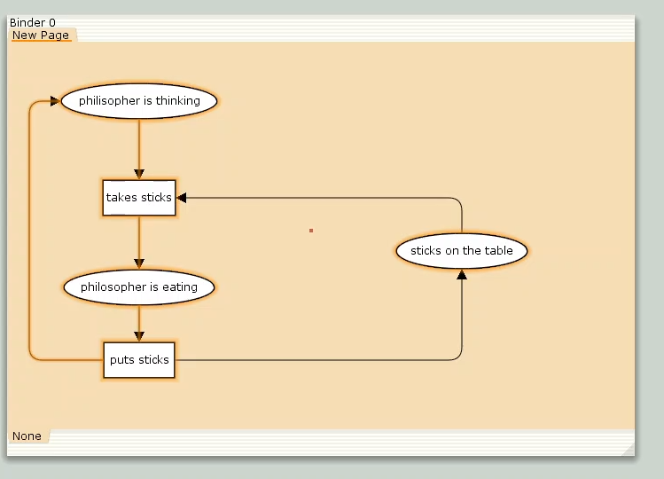
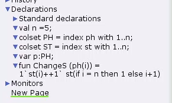
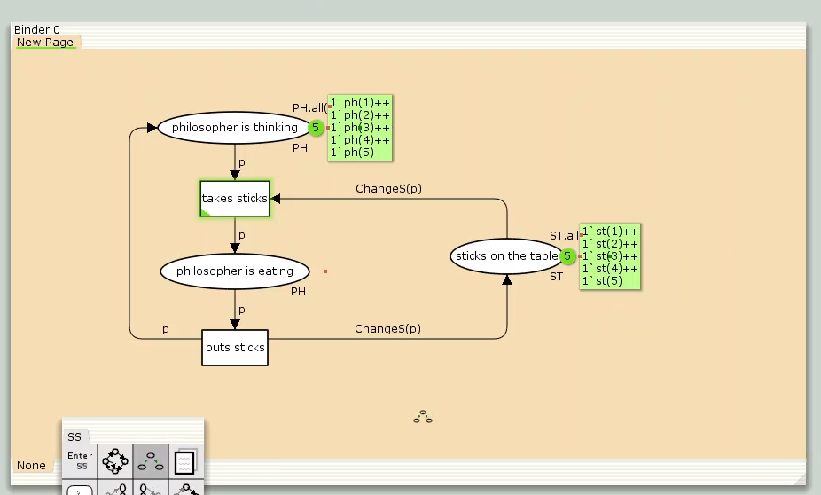
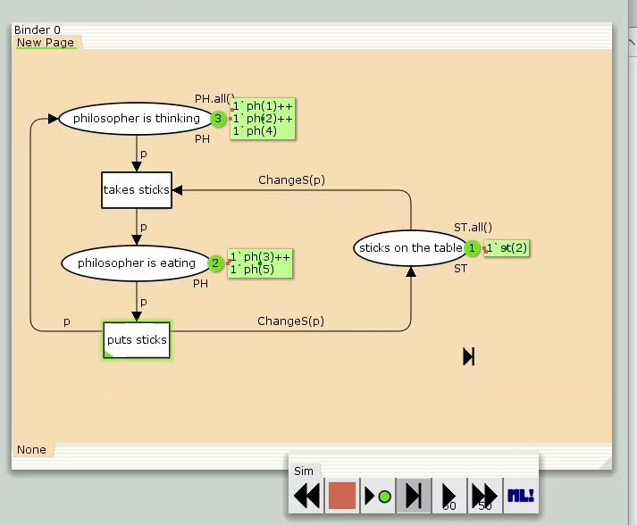
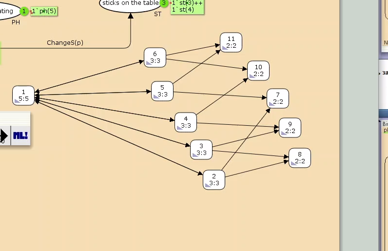

---
## Front matter
lang: ru-RU
title: Лабораторная работа № 10
subtitle: Задача об обедающих мудрецах
author:
  - Мугари Абдеррахим
institute:
  - Российский университет дружбы народов, Москва, Россия
date: 12 апреля 2025

## i18n babel
babel-lang: russian
babel-otherlangs: english

## Formatting pdf
toc: false
toc-title: Содержание
slide_level: 2
aspectratio: 169
section-titles: true
theme: metropolis
header-includes:
 - \metroset{progressbar=frametitle,sectionpage=progressbar,numbering=fraction}
---

# Информация

## Преподаватель 

:::::::::::::: {.columns align=center}
::: {.column width="70%"}

  * Анна Владиславовна Королькова
  * доцент кафедры прикладной информатики и теории вероятностей РУДН; 
  * заведующий лабораторией кафедры прикладной информатики и теории вероятностей РУДН (по совместительству); 
  *  программист I кат. 
  * Российский университет дружбы народов
  * [korolkova-av@rudn.ru](mailto:korolkova-av@rudn.ru)

:::
::: {.column width="30%"}


:::
::::::::::::::

## Докладчик

:::::::::::::: {.columns align=center}
::: {.column width="70%"}

  * Мугари Абдеррахим
  * Студент третьего курса 
  * фундаментальная информатика и информационные технологии
  * Российский университет дружбы народов
  * [1032215692@rudn.ru](mailto:1032215692@rudn.ru)
  * <https://iragoum.github.io/>

:::
::: {.column width="30%"}


:::
::::::::::::::

# Цель работы

- Основной целью лабораторной работы является построение модели задачи об обедающих мудрецах в среде CPN Tools.

# Задание

- Реализовать модель задачи в CPN Tools;
- Провести анализ пространства состояний, подготовить отчет и визуализировать граф переходов.

# Выполнение лабораторной работы

## Задача об обедающих мудрецах

**Описание проблемы**

Пять философов сидят вокруг круглого стола. Каждый может находиться в состоянии размышления или приема пищи. Для еды требуются две палочки, расположенные между соседями. Задача заключается в синхронизации доступа к общим ресурсам (палочкам), чтобы избежать deadlock-ситуаций 

Для моделирования создана сеть Петри: через контекстное меню добавлены позиции, переходы и дуги 

Исходные параметры:

- Позиции: 
  - `philosopher thinks` (мудрец размышляет),
  - `philosopher eats` (мудрец ест),
  - `sticks on the table` (палочки на столе).
  
## Задача об обедающих мудрецах

- Переходы: 
  - `take sticks` (взять палочки),
  - `put sticks` (положить палочки).

{#fig:001 width=50%}

## Задача об обедающих мудрецах

В настройках модели определены декларации 

- Константа `n = 5` (количество мудрецов и палочек);
- Типы фишек:
  - `PH` (перечисление мудрецов от 1 до n),
  - `ST` (перечисление палочек от 1 до n);
  
## Задача об обедающих мудреца

- Функция `ChangeS(p)`, определяющая палочки для каждого мудреца:

```
  fun ChangeS (ph(i)) = 
    1`st(i) ++ st(if i = n then 1 else i+1)
```

## Описание модели задачи об обедающих мудрецах

На рисунке ниже представлена схема деклараций для классической задачи о синхронизации процессов 

{#fig:002 width=50%}

## Описание модели задачи об обедающих мудрецах

Результирующая модель после настройки показана на рисунке . При запуске модели наблюдается, что одновременно использовать палочки могут не более двух философов из пяти 

{#fig:003 width=50%}


## Описание модели задачи об обедающих мудрецах


{#fig:004 width=50%}

## Анализ пространства состояний

Для анализа был построен граф пространства состояний, содержащий 11 узлов 

{#fig:005 width=35%}

### Основные выводы из отчета:
1. **Структура пространства**:
   - 11 уникальных состояний
   - 30 переходов между состояниями
   
## Анализ пространства состояний

2. **Граничные значения**:
   - Думающие философы: от 3 до 5
   - Едящие философы: от 0 до 2
   - Палочки на столе: от 1 до 5 (минимум 2 в финальной фазе)

3. **Свойства сети**:
   - Все состояния достижимы из любого узла (маркировка `home` присутствует везде)
   - Отсутствуют тупиковые состояния (`dead marking = None`)
   - Бесконечно повторяющиеся события: взятие и возврат палочек


## Отчет

Отчет формировался автоматически через инструменты анализа сетей Петри. Для сохранения результатов использовалась функция экспорта отчета в файл.
```
CPN Tools state space report for:
/home/openmodelica/Desktop/phil.cpn
Report generated: Sat Apr 12 22:58:36 2025
 Statistics
------------------------------------------------------------------------
  State Space
     Nodes:  11
     Arcs:   30
     Secs:   0
     Status: Full
```

## Отчет

```

  Scc Graph
     Nodes:  1
     Arcs:   0
     Secs:   0
 Boundedness Properties
------------------------------------------------------------------------

  Best Integer Bounds
                             Upper      Lower
     New_Page'philosopher_is_eating 1
                             2          0
     New_Page'philosopher_is_thinking 1
                             5          3
     New_Page'sticks_on_the_table 1		
                             5          1
```
## Отчет

```

  Best Upper Multi-set Bounds
     New_Page'philosopher_is_eating 1
                         1`ph(1)++
1`ph(2)++
1`ph(3)++
1`ph(4)++
1`ph(5)
     New_Page'philosopher_is_thinking 1
                         1`ph(1)++
1`ph(2)++
1`ph(3)++
1`ph(4)++

```
## Отчет

```

1`ph(5)
     New_Page'sticks_on_the_table 1
                         1`st(1)++
1`st(2)++
1`st(3)++
1`st(4)++
1`st(5)

  Best Lower Multi-set Bounds
     New_Page'philosopher_is_eating 1
                         empty
     New_Page'philosopher_is_thinking 1
                         empty
     New_Page'sticks_on_the_table 1
                         empty
```
## Отчет

```

 Home Properties
------------------------------------------------------------------------
  Home Markings
     All
 Liveness Properties
------------------------------------------------------------------------
  Dead Markings
     None
  Dead Transition Instances
     None
  Live Transition Instances
     All
 Fairness Properties
------------------------------------------------------------------------
       New_Page'puts_sticks 1 Impartial
       New_Page'takes_sticks 1
                         Impartial
```


# Выводы

В рамках лабораторной работы была разработана модель задачи об обедающих мудрецах с использованием CPN Tools.

