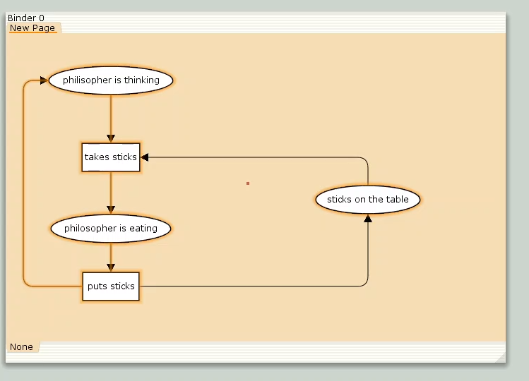
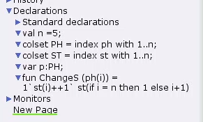
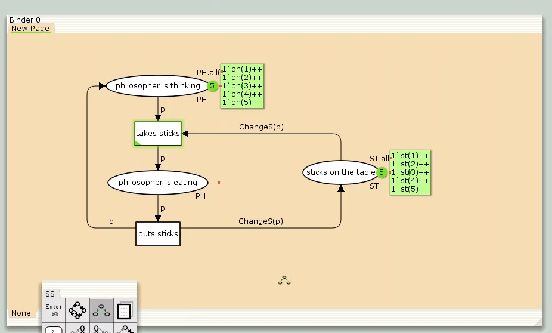
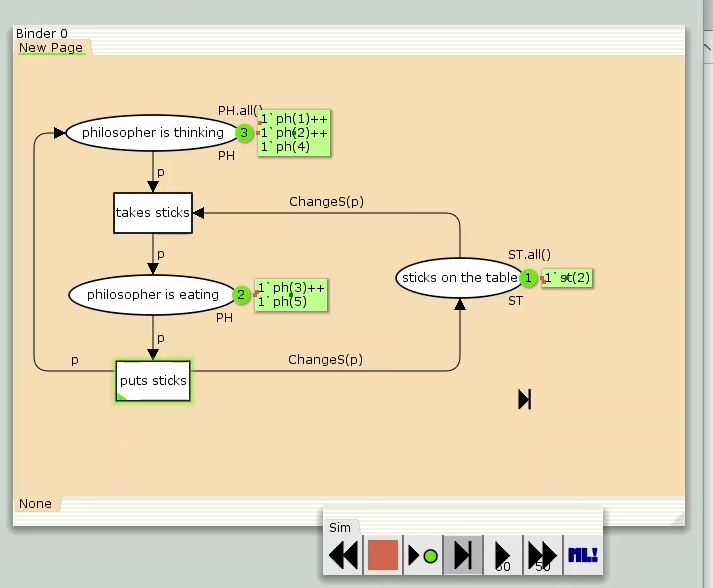
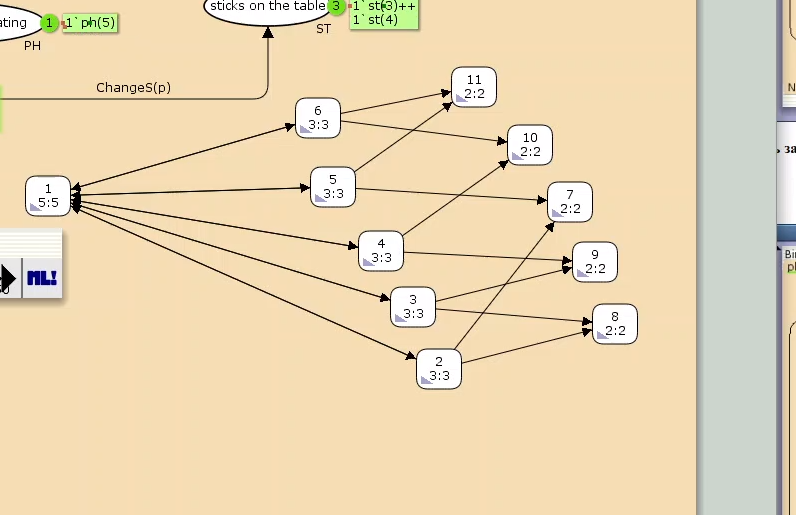

---
## Front matter
title: "Лабораторная работа № 10"
subtitle: "Задача об обедающих мудрецах"
author: "Мугари Абдеррахим"

## Generic otions
lang: ru-RU
toc-title: "Содержание"

## Bibliography
bibliography: bib/cite.bib
csl: pandoc/csl/gost-r-7-0-5-2008-numeric.csl

## Pdf output format
toc: true # Table of contents
toc-depth: 2
lof: true # List of figures
lot: true # List of tables
fontsize: 12pt
linestretch: 1.5
papersize: a4
documentclass: scrreprt
## I18n polyglossia
polyglossia-lang:
  name: russian
  options:
	- spelling=modern
	- babelshorthands=true
polyglossia-otherlangs:
  name: english
## I18n babel
babel-lang: russian
babel-otherlangs: english
## Fonts
mainfont: IBM Plex Serif
romanfont: IBM Plex Serif
sansfont: IBM Plex Sans
monofont: IBM Plex Mono
mathfont: STIX Two Math
mainfontoptions: Ligatures=Common,Ligatures=TeX,Scale=0.94
romanfontoptions: Ligatures=Common,Ligatures=TeX,Scale=0.94
sansfontoptions: Ligatures=Common,Ligatures=TeX,Scale=MatchLowercase,Scale=0.94
monofontoptions: Scale=MatchLowercase,Scale=0.94,FakeStretch=0.9
mathfontoptions:
## Biblatex
biblatex: true
biblio-style: "gost-numeric"
biblatexoptions:
  - parentracker=true
  - backend=biber
  - hyperref=auto
  - language=auto
  - autolang=other*
  - citestyle=gost-numeric
## Pandoc-crossref LaTeX customization
figureTitle: "Рис."
tableTitle: "Таблица"
listingTitle: "Листинг"
lofTitle: "Список иллюстраций"

lotTitle: "Список таблиц"
lolTitle: "Листинги"
## Misc options
indent: true
header-includes:
  - \usepackage{indentfirst}
  - \usepackage{float} # keep figures where there are in the text
  - \floatplacement{figure}{H} # keep figures where there are in the text
---

# Цель работы

- Основной целью лабораторной работы является построение модели задачи об обедающих мудрецах в среде CPN Tools.

# Задание

- Реализовать модель задачи в CPN Tools;
- Провести анализ пространства состояний, подготовить отчет и визуализировать граф переходов.

# Выполнение лабораторной работы

## Задача об обедающих мудрецах

**Описание проблемы**

Пять философов сидят вокруг круглого стола. Каждый может находиться в состоянии размышления или приема пищи. Для еды требуются две палочки, расположенные между соседями. Задача заключается в синхронизации доступа к общим ресурсам (палочкам), чтобы избежать deadlock-ситуаций [@l:bash].

Для моделирования создана сеть Петри: через контекстное меню добавлены позиции, переходы и дуги (рис. [-@fig:001]).

Исходные параметры:

- Позиции: 
  - `philosopher thinks` (мудрец размышляет),
  - `philosopher eats` (мудрец ест),
  - `sticks on the table` (палочки на столе).

- Переходы: 
  - `take sticks` (взять палочки),
  - `put sticks` (положить палочки).

{#fig:001 width=70%}

В настройках модели определены декларации (рис. [-@fig:002]):

- Константа `n = 5` (количество мудрецов и палочек);
- Типы фишек:
  - `PH` (перечисление мудрецов от 1 до n),
  - `ST` (перечисление палочек от 1 до n);
- Функция `ChangeS(p)`, определяющая палочки для каждого мудреца:

```
  fun ChangeS (ph(i)) = 
    1`st(i) ++ st(if i = n then 1 else i+1)
```

## Описание модели задачи об обедающих мудрецах

На рисунке ниже представлена схема деклараций для классической задачи о синхронизации процессов (рис. [@fig:002]).

{#fig:002 width=70%}

Результирующая модель после настройки показана на рисунке [@fig:003]. При запуске модели наблюдается, что одновременно использовать палочки могут не более двух философов из пяти (рис. [@fig:004]).

{#fig:003 width=70%}


{#fig:004 width=70%}

## Анализ пространства состояний

Для анализа был построен граф пространства состояний, содержащий 11 узлов (рис. [@fig:005]). 

{#fig:005 width=70%}

### Основные выводы из отчета:
1. **Структура пространства**:
   - 11 уникальных состояний
   - 30 переходов между состояниями

2. **Граничные значения**:
   - Думающие философы: от 3 до 5
   - Едящие философы: от 0 до 2
   - Палочки на столе: от 1 до 5 (минимум 2 в финальной фазе)

3. **Свойства сети**:
   - Все состояния достижимы из любого узла (маркировка `home` присутствует везде)
   - Отсутствуют тупиковые состояния (`dead marking = None`)
   - Бесконечно повторяющиеся события: взятие и возврат палочек

Отчет формировался автоматически через инструменты анализа сетей Петри. Для сохранения результатов использовалась функция экспорта отчета в файл.
```
CPN Tools state space report for:
/home/openmodelica/Desktop/phil.cpn
Report generated: Sat Apr 12 22:58:36 2025


 Statistics
------------------------------------------------------------------------

  State Space
     Nodes:  11
     Arcs:   30
     Secs:   0
     Status: Full

  Scc Graph
     Nodes:  1
     Arcs:   0
     Secs:   0


 Boundedness Properties
------------------------------------------------------------------------

  Best Integer Bounds
                             Upper      Lower
     New_Page'philosopher_is_eating 1
                             2          0
     New_Page'philosopher_is_thinking 1
                             5          3
     New_Page'sticks_on_the_table 1		
                             5          1

  Best Upper Multi-set Bounds
     New_Page'philosopher_is_eating 1
                         1`ph(1)++
1`ph(2)++
1`ph(3)++
1`ph(4)++
1`ph(5)
     New_Page'philosopher_is_thinking 1
                         1`ph(1)++
1`ph(2)++
1`ph(3)++
1`ph(4)++
1`ph(5)
     New_Page'sticks_on_the_table 1
                         1`st(1)++
1`st(2)++
1`st(3)++
1`st(4)++
1`st(5)

  Best Lower Multi-set Bounds
     New_Page'philosopher_is_eating 1
                         empty
     New_Page'philosopher_is_thinking 1
                         empty
     New_Page'sticks_on_the_table 1
                         empty


 Home Properties
------------------------------------------------------------------------

  Home Markings
     All


 Liveness Properties
------------------------------------------------------------------------

  Dead Markings
     None

  Dead Transition Instances
     None

  Live Transition Instances
     All


 Fairness Properties
------------------------------------------------------------------------
       New_Page'puts_sticks 1 Impartial
       New_Page'takes_sticks 1
                         Impartial
```


# Выводы

В рамках лабораторной работы была разработана модель задачи об обедающих мудрецах с использованием CPN Tools.

# Список литературы{.unnumbered}

::: {#refs}
:::
