---
## Front matter
lang: ru-RU
title: Лабораторная работа № 11
subtitle: Модель системы массового обслуживания M|M|1
author:
  - Мугари Абдеррахим
institute:
  - Российский университет дружбы народов, Москва, Россия
date: 19 апреля 2025

## i18n babel
babel-lang: russian
babel-otherlangs: english

## Formatting pdf
toc: false
toc-title: Содержание
slide_level: 2
aspectratio: 169
section-titles: true
theme: metropolis
header-includes:
 - \metroset{progressbar=frametitle,sectionpage=progressbar,numbering=fraction}
---

# Информация

## Преподаватель 

:::::::::::::: {.columns align=center}
::: {.column width="70%"}

  * Анна Владиславовна Королькова
  * доцент кафедры прикладной информатики и теории вероятностей РУДН; 
  * заведующий лабораторией кафедры прикладной информатики и теории вероятностей РУДН (по совместительству); 
  *  программист I кат. 
  * Российский университет дружбы народов
  * [korolkova-av@rudn.ru](mailto:korolkova-av@rudn.ru)

:::
::: {.column width="30%"}

:::
::::::::::::::

## Докладчик

:::::::::::::: {.columns align=center}
::: {.column width="70%"}

  * Мугари Абдеррахим
  * Студент третьего курса 
  * фундаментальная информатика и информационные технологии
  * Российский университет дружбы народов
  * [1032215692@rudn.ru](mailto:1032215692@rudn.ru)
  * <https://iragoum.github.io/>

:::
::: {.column width="30%"}

:::
::::::::::::::

## Цель и задачи

### Цель работы

Создание модели системы массового обслуживания M|M|1 с использованием среды моделирования CPN Tools.

## Задание

- Построить модель M|M|1 в CPN Tools.
- Настроить мониторинг ключевых параметров работы системы.
- Визуализировать графики изменения длины очереди во времени.
---

# Выполнение лабораторной работы

## Постановка задачи

Необходимо смоделировать систему, в которую поступают заявки двух типов. Поток заявок подчиняется пуассоновскому распределению. Все заявки направляются в очередь на обработку, где применяется дисциплина обслуживания FIFO (первым пришёл — первым обслужен). Если сервер свободен, он немедленно начинает обработку поступившей заявки

---

## Реализация модели M|M|1 в CPN Tools

Модель реализована в среде CPN Tools и разделена на три отдельных листа:

1. **System** — основная схема модели.
2. **Generator** — схема генерации заявок.
3. **Server** — схема обработки заявок .

- Основной граф модели (лист System)

На листе описывается структура системы:

- **Позиции:** 
  - `Queue` — очередь заявок;
  - `Completed` — завершённые заявки.
  
## Реализация модели M|M|1 в CPN Tools

- **Переходы:** 
  - `Arrivals` — генерация новых заявок; 
  - `Server` — передача заявки на обработку.

Оба перехода имеют иерархическую структуру, которую можно настроить с помощью инструмента *Hierarchy*.  
Между `Arrivals` и `Queue`, а также между `Queue` и `Server` — двусторонняя связь. Между `Server` и `Complited` — односторонняя.

## Реализация модели M|M|1 в CPN Tools

- Граф генерации заявок (лист Generator)

Здесь реализована логика поступления заявок:

- **Позиции:**  
  - `Init` — текущая заявка;  
  - `Next` — следующая заявка;  
  - `Queue` — ссылка на позицию очереди из листа *System*.

- **Переходы:**  
  - `Init` — моделирует поступление заявок с экспоненциальным распределением (интенсивность: 100 заявок в единицу времени);  
  - `Arrive` — подача заявки в очередь.
  
## Реализация модели M|M|1 в CPN Tools

- Граф обработки заявок (лист Server)

Этот лист описывает поведение сервера:

- **Позиции:**  
  - `Busy` — сервер в работе;  
  - `Idle` — сервер свободен;  
  - `Queue` и `Complited` — позиции из листа *System*.

- **Переходы:**  
  - `Start` — начало обработки заявки;  
  - `Stop` — завершение обработки.

---

## Граф сети системы обработки заявок в очередь

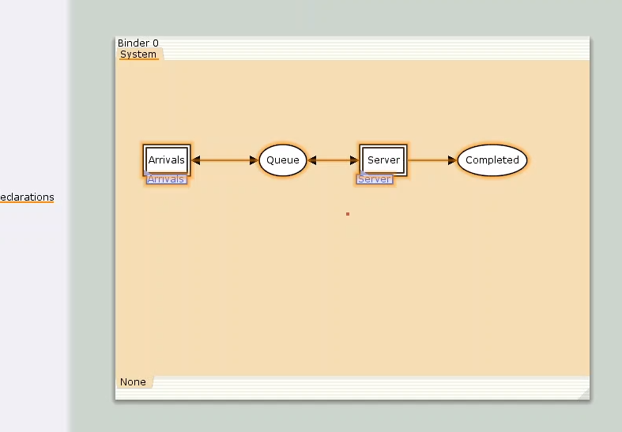{#fig:001 width=50%}

## Граф генератора заявок системы

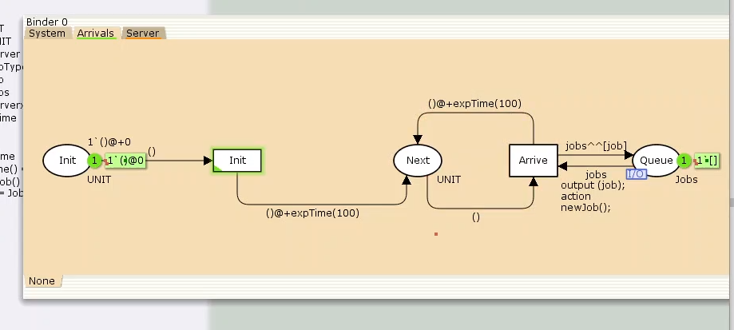{#fig:002 width=50%}

## Граф процесса обработки заявок на сервере системы

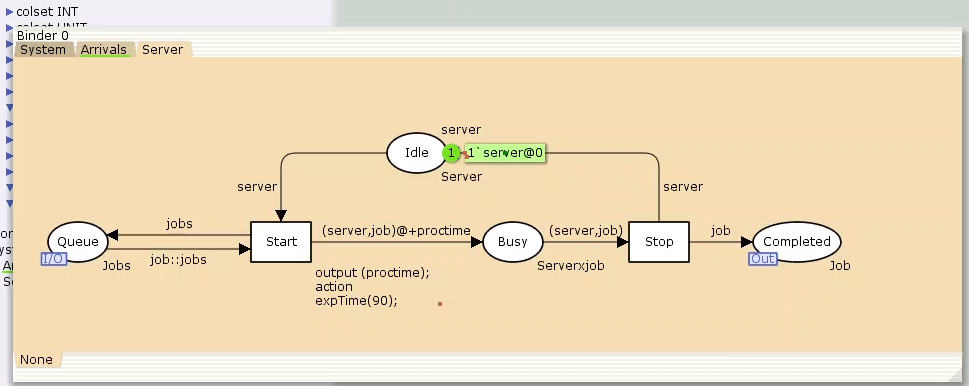{#fig:003 width=50%}

В дальнейшем необходимо определить декларации для каждой части модели 

## Декларации модели

- Множества цветов (colorset)

В модели определены следующие типы данных (множества цветов), используемые для представления различных сущностей в системе:

- **UNIT** — используется для фиксации моментов времени.
- **INT** — обозначает моменты поступления заявок в систему.
- **JobType** — определяет два возможных типа заявок: `A` и `B`.
- **Job** — кортеж, состоящий из двух полей:
  - `jobType` (тип `JobType`) — обозначает тип заявки;
  - `AT` (тип `INT`) — хранит время, в течение которого заявка находится в системе.
- **Jobs** — список заявок (тип — список объектов `Job`).
- **ServerxJob** — состояние сервера, когда он занят конкретной заявкой.

---

## Переменные модели

Модель использует следующие переменные:

- `proctime` — время, затрачиваемое на обработку одной заявки;
- `job` — отдельная заявка;
- `jobs` — список заявок, поступивших в очередь.

---

## Встроенные функции модели

Для корректной генерации и обработки заявок определены следующие функции:

- `expTime()` — возвращает случайные значения, моделирующие интервалы времени между поступлениями заявок на основе экспоненциального распределения;
- `intTime()` — преобразует текущее модельное время в целое число;
- `newJob()` — создает новую заявку (`Job`), случайным образом выбирая тип (`A` или `B`).

---

## Определения множества цветов системы

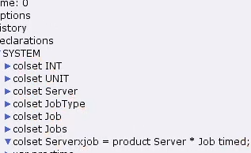{#fig:004 width=70%}

## Определение переменных модели

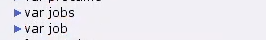{#fig:005 width=70%}

## Определение функций системы

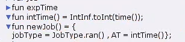{#fig:006 width=70%}

## Настройка параметров модели в CPN Tools

Для корректной работы модели в CPN Tools были заданы параметры элементов на всех трех листах: **System**, **Arrivals** и **Server**.

---

## Лист `System`

На данном листе представлены основные элементы сети массового обслуживания:

- **Позиция `Queue`**:
  - Цветовое множество: `Jobs`.
  - Начальная маркировка: `1'[]`, что указывает на пустую очередь в начале моделирования.

- **Позиция `Completed`**:
  - Цветовое множество: `Job`.
  
## Параметры элементов основного графа системы обработки заявок в очереди

{#fig:007 width=70%}

---

## Лист `Arrivals` — генератор заявок

На этом листе формируются заявки, поступающие в систему:

- **Позиция `Init`**:
  - Цветовое множество: `UNIT`.
  - Начальная маркировка: `1'()@0`, что означает начало генерации заявок с нулевого времени.

- **Позиция `Next`**:
  - Цветовое множество: `UNIT`.

- **Переход `Init`**:
  - На дуге из `Init`: выражение `()` — инициирует генерацию заявок.
  - На дугах от `Init` и `Arrive` к `Next`: `()@+expTime(100)` — задаёт интервалы между заявками по экспоненциальному распределению со средней интенсивностью 100.

- **Переход `Arrive`**:
  - На дуге из `Next`: `()` — передаёт сигнал генерации.
  - На дуге к `Queue`: `jobs^^[job]` — добавляет заявку в очередь.
  - Обратная связь с `Queue`: `jobs`.
  
## Параметры элементов генератора заявок системы

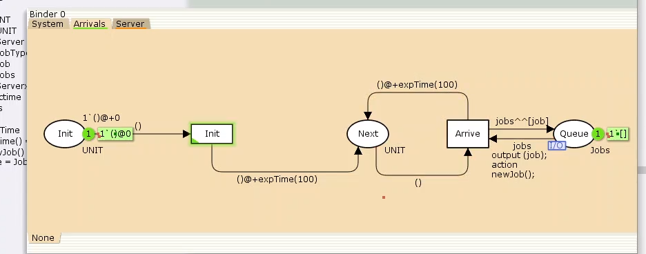{#fig:008 width=70%}

## Лист `Server` — обработка заявок

На этом листе смоделирован сервер, обрабатывающий заявки:

- **Позиция `Busy`**:
  - Цветовое множество: `Server`.
  - Начальная маркировка: `1'server@+0` — сервер свободен в начале моделирования.

- **Позиция `Idle`**:
  - Цветовое множество: `ServerxJob`.

- **Переход `Start`**:
  - Output: `proctime`.
  - Action: `expTime(90)` — определяет, что время обработки заявки подчиняется экспоненциальному распределению со средним значением 90.
  
## Лист `Server` — обработка заявок

  - На дуге от `Queue`: `job::jobs` — позволяет начать обработку, если есть заявки.
  - К `Busy`: `(server, job)@+proctime` — передача заявки на сервер с учетом времени обработки.
  - Обратная связь в `Queue`: `jobs`.

- **Переход `Stop`**:
  - От `Busy`: `(server, job)` — завершение обработки заявки.
  - К `Completed`: `job` — заявка считается обслуженной.
  - Состояние сервера обновляется через `Idle`: `server`.
  
## Параметры элементов графа обработки заявок

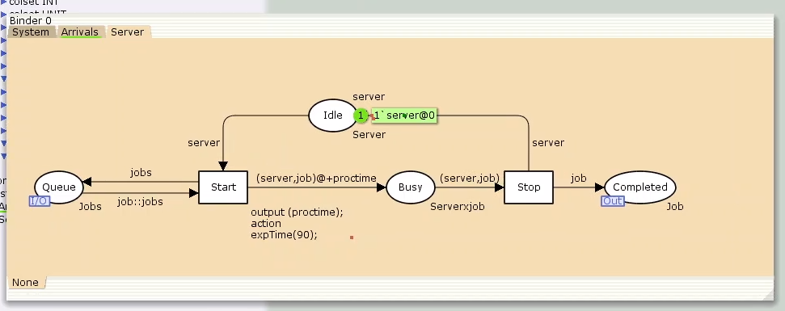{#fig:009 width=70%}

## Запуск системы обработки заявок в очереди

После задания всех необходимых параметров компоненты обработчика заявок активируются, и система начинает функционировать, как показано на рисунке ниже.

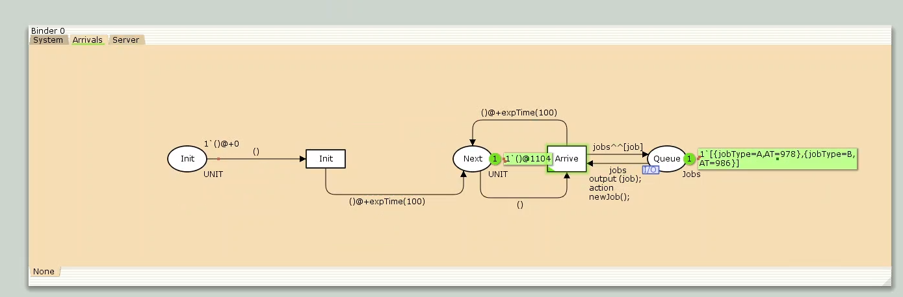{#fig:0010 width=70%}

## Мониторинг параметров моделируемой системы

Для отслеживания параметров используется палитра **Monitoring**. В первую очередь добавляется **Break Point**, который размещается на переходе `Start`. После этого в меню **Monitor** появляется новый раздел, назовём его `Ostanovka`.

В этом разделе необходимо изменить функцию `Predicate`, отвечающую за условие активации монитора. Стандартное значение `true` заменяется на выражение `Queue_Delay.count()=200`, чтобы монитор срабатывал каждые 200 заявок.

## Функция Predicate монитора Ostanovka

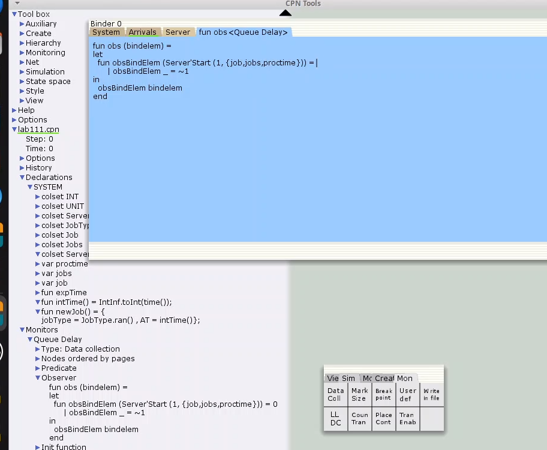{#fig:011 width=70%}

## Определение функции `Queue_Delay.count()`

С помощью палитры **Monitoring** выбирается элемент **Data Call**, который размещается также на переходе `Start`. Новый монитор следует назвать `Queue Delay` (без подчеркивания). 

Функция `Observer` будет выполняться, когда предикат возвращает `true`. По умолчанию она возвращает 0 или ~1, где подчёркивание обозначает произвольный аргумент. Чтобы получить значение задержки, нужно из текущего времени `intTime()` вычесть временную метку `AT`, которая указывает момент поступления заявки в очередь.

## Функция Observer монитора Queue Delay

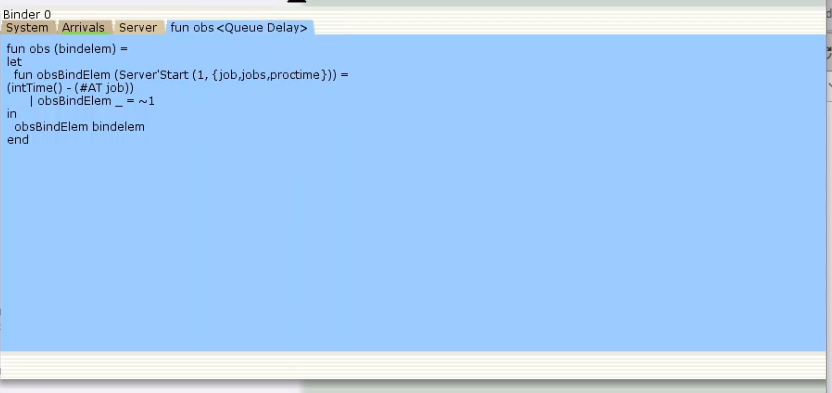{#fig:012 width=70%}

## Вычисление задержки в действительных значениях

Для получения задержки в виде действительных чисел, снова используется **Data Call** на переходе `Start`. Новый монитор называется `Queue Delay Real`. Функцию `Observer` следует изменить так, чтобы результат преобразовывался в тип `real` (например, используя `~1.0`).

После запуска системы в каталоге проекта появится файл `Queue_Delay_Real.log` с данными, аналогичными файлу `Queue_Delay.log`, но с действительными значениями.

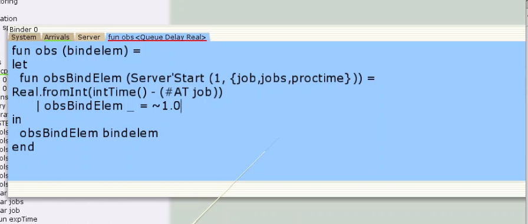{#fig:013 width=40%}

## Подсчёт случаев превышения задержки

Чтобы посчитать количество случаев, когда задержка превысила заданное значение, снова используется **Data Call** на переходе `Start`. Новый монитор следует назвать `Long Delay Time`, и изменить в нём функцию `Observer`, как показано ниже.

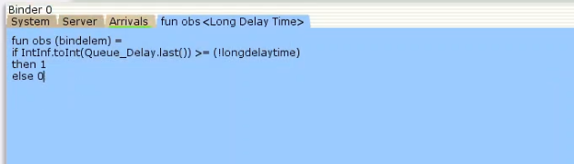{#fig:014 width=50%}

## Подсчёт случаев превышения задержки

После запуска системы создается файл `Queue_Delay.log`, где:
- первая колонка — значение задержки,
- вторая — счётчик,
- третья — шаг,
- четвёртая — время.

С помощью **gnuplot** можно построить график изменения задержки, используя:
- по оси X — время,
- по оси Y — значения задержки.

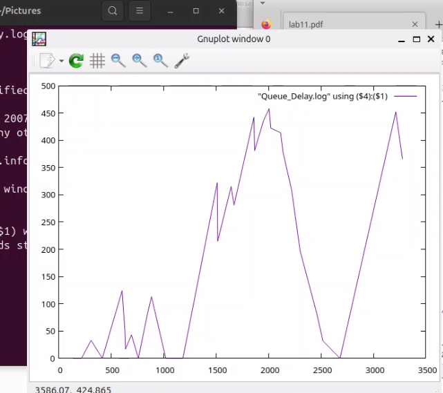{#fig:015 width=30%}

## Подсчёт случаев превышения задержки

С помощью **gnuplot** можно построить график, иллюстрирующий периоды времени, в которые значения задержки в очереди превышали установленный порог — 200. Этот график помогает визуализировать моменты перегрузки в системе (см. рисунок ниже).

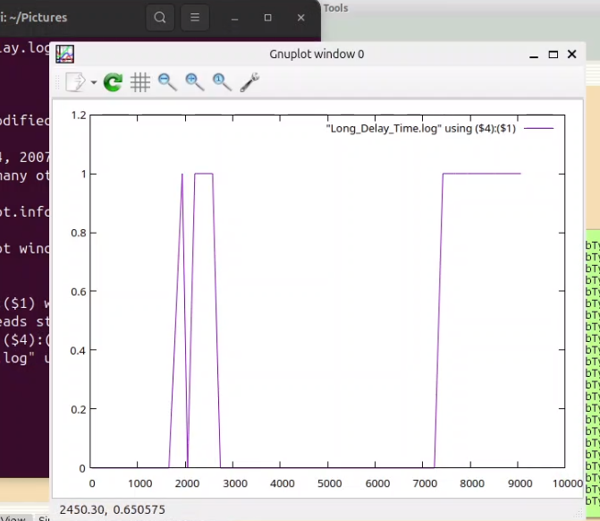{#fig:016 width=35%}

# Выводы

В рамках выполненной работы была разработана и реализована модель системы массового обслуживания **M|M|1** с использованием среды **CPN Tools**.
