---
## Front matter
title: "Лабораторная работа № 11"
subtitle: "Модель системы массового обслуживания M|M|1"
author: "Мугари Абдеррахим"

## Generic otions
lang: ru-RU
toc-title: "Содержание"

## Bibliography
bibliography: bib/cite.bib
csl: pandoc/csl/gost-r-7-0-5-2008-numeric.csl

## Pdf output format
toc: true # Table of contents
toc-depth: 2
lof: true # List of figures
lot: false # List of tables
fontsize: 12pt
linestretch: 1.5
papersize: a4
documentclass: scrreprt
## I18n polyglossia
polyglossia-lang:
  name: russian
  options:
	- spelling=modern
	- babelshorthands=true
polyglossia-otherlangs:
  name: english
## I18n babel
babel-lang: russian
babel-otherlangs: english
## Fonts
mainfont: IBM Plex Serif
romanfont: IBM Plex Serif
sansfont: IBM Plex Sans
monofont: IBM Plex Mono
mathfont: STIX Two Math
mainfontoptions: Ligatures=Common,Ligatures=TeX,Scale=0.94
romanfontoptions: Ligatures=Common,Ligatures=TeX,Scale=0.94
sansfontoptions: Ligatures=Common,Ligatures=TeX,Scale=MatchLowercase,Scale=0.94
monofontoptions: Scale=MatchLowercase,Scale=0.94,FakeStretch=0.9
mathfontoptions:
## Biblatex
biblatex: true
biblio-style: "gost-numeric"
biblatexoptions:
  - parentracker=true
  - backend=biber
  - hyperref=auto
  - language=auto
  - autolang=other*
  - citestyle=gost-numeric
## Pandoc-crossref LaTeX customization
figureTitle: "Рис."
tableTitle: "Таблица"
listingTitle: "Листинг"
lofTitle: "Список иллюстраций"
lotTitle: "Список таблиц"
lolTitle: "Листинги"
## Misc options
indent: true
header-includes:
  - \usepackage{indentfirst}
  - \usepackage{float} # keep figures where there are in the text
  - \floatplacement{figure}{H} # keep figures where there are in the text
---

## Цель и задачи

### Цель работы

Создание модели системы массового обслуживания M|M|1 с использованием среды моделирования CPN Tools.

### Задание

- Построить модель M|M|1 в CPN Tools.
- Настроить мониторинг ключевых параметров работы системы.
- Визуализировать графики изменения длины очереди во времени.

---

## Теоретическое введение

CPN Tools представляет собой специализированную программную среду для построения и анализа иерархических временных раскрашенных сетей Петри. Такие сети обладают вычислительной мощностью, аналогичной машине Тьюринга, что позволяет использовать их для моделирования любых алгоритмически представимых процессов [@cpn:bash].

Одной из сильных сторон CPN Tools является возможность графической визуализации моделей на основе сетей Петри, а также поддержка формального описания с использованием языка CPN ML (Colored Petri Net Markup Language).

### Области применения CPN Tools:

- моделирование сложных объектов и процессов;
- анализ производственных и бизнес-процессов;
- проектирование и исследование систем управления (включая промышленные роботы);
- формализация и проверка сетевых протоколов;
- оценка параметров телекоммуникационных систем, включая пропускную способность и качество обслуживания.

Эти возможности делают CPN Tools мощным инструментом для решения задач в инженерии, бизнесе и телекоммуникациях.

# Выполнение лабораторной работы

## Постановка задачи

Необходимо смоделировать систему, в которую поступают заявки двух типов. Поток заявок подчиняется пуассоновскому распределению. Все заявки направляются в очередь на обработку, где применяется дисциплина обслуживания FIFO (первым пришёл — первым обслужен). Если сервер свободен, он немедленно начинает обработку поступившей заявки [@l:bash].

---

## Реализация модели M|M|1 в CPN Tools

Модель реализована в среде CPN Tools и разделена на три отдельных листа:

1. **System** — основная схема модели (см. рисунок [-@fig:001]);
2. **Generator** — схема генерации заявок (см. рисунок [-@fig:002]);
3. **Server** — схема обработки заявок (см. рисунок [-@fig:003]).

### Основной граф модели (лист System)

На листе описывается структура системы:

- **Позиции:**  
  - `Queue` — очередь заявок;  
  - `Complited` — завершённые заявки.

- **Переходы:**  
  - `Arrivals` — генерация новых заявок;  
  - `Server` — передача заявки на обработку.

Оба перехода имеют иерархическую структуру, которую можно настроить с помощью инструмента *Hierarchy*.  
Между `Arrivals` и `Queue`, а также между `Queue` и `Server` — двусторонняя связь. Между `Server` и `Complited` — односторонняя.

### Граф генерации заявок (лист Generator)

Здесь реализована логика поступления заявок:

- **Позиции:**  
  - `Init` — текущая заявка;  
  - `Next` — следующая заявка;  
  - `Queue` — ссылка на позицию очереди из листа *System*.

- **Переходы:**  
  - `Init` — моделирует поступление заявок с экспоненциальным распределением (интенсивность: 100 заявок в единицу времени);  
  - `Arrive` — подача заявки в очередь.

### Граф обработки заявок (лист Server)

Этот лист описывает поведение сервера:

- **Позиции:**  
  - `Busy` — сервер в работе;  
  - `Idle` — сервер свободен;  
  - `Queue` и `Complited` — позиции из листа *System*.

- **Переходы:**  
  - `Start` — начало обработки заявки;  
  - `Stop` — завершение обработки.

---

### Иллюстрации

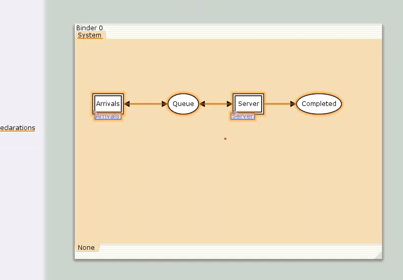{#fig:001 width=70%}

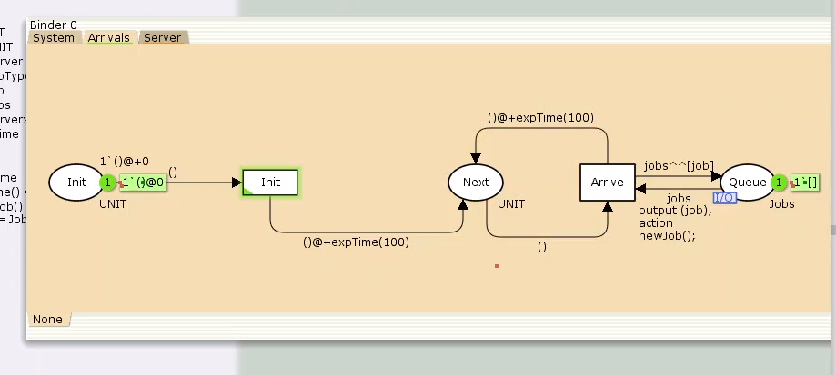{#fig:002 width=70%}

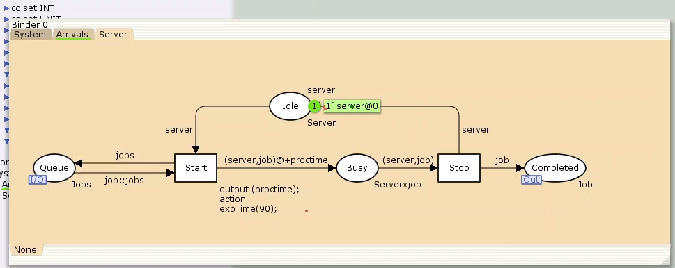{#fig:003 width=70%}

В дальнейшем необходимо определить декларации для каждой части модели (см. рисунки [-@fig:004]-[-@fig:006]).

## Декларации модели

### Множества цветов (colorset)

В модели определены следующие типы данных (множества цветов), используемые для представления различных сущностей в системе:

- **UNIT** — используется для фиксации моментов времени.
- **INT** — обозначает моменты поступления заявок в систему.
- **JobType** — определяет два возможных типа заявок: `A` и `B`.
- **Job** — кортеж, состоящий из двух полей:
  - `jobType` (тип `JobType`) — обозначает тип заявки;
  - `AT` (тип `INT`) — хранит время, в течение которого заявка находится в системе.
- **Jobs** — список заявок (тип — список объектов `Job`).
- **ServerxJob** — состояние сервера, когда он занят конкретной заявкой.

---

### Переменные модели

Модель использует следующие переменные:

- `proctime` — время, затрачиваемое на обработку одной заявки;
- `job` — отдельная заявка;
- `jobs` — список заявок, поступивших в очередь.

---

### Встроенные функции модели

Для корректной генерации и обработки заявок определены следующие функции:

- `expTime()` — возвращает случайные значения, моделирующие интервалы времени между поступлениями заявок на основе экспоненциального распределения;
- `intTime()` — преобразует текущее модельное время в целое число;
- `newJob()` — создает новую заявку (`Job`), случайным образом выбирая тип (`A` или `B`).

---

### Иллюстрации

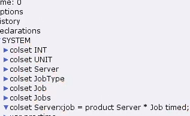{#fig:004 width=70%}

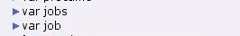{#fig:005 width=70%}

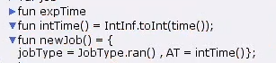{#fig:006 width=70%}

## Настройка параметров модели в CPN Tools

Для корректной работы модели в CPN Tools были заданы параметры элементов на всех трех листах: **System**, **Arrivals** и **Server**.

---

### Лист `System`

На данном листе представлены основные элементы сети массового обслуживания:

- **Позиция `Queue`**:
  - Цветовое множество: `Jobs`.
  - Начальная маркировка: `1'[]`, что указывает на пустую очередь в начале моделирования.

- **Позиция `Completed`**:
  - Цветовое множество: `Job`.

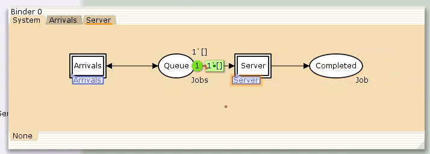{#fig:007 width=70%}

---

### Лист `Arrivals` — генератор заявок

На этом листе формируются заявки, поступающие в систему:

- **Позиция `Init`**:
  - Цветовое множество: `UNIT`.
  - Начальная маркировка: `1'()@0`, что означает начало генерации заявок с нулевого времени.

- **Позиция `Next`**:
  - Цветовое множество: `UNIT`.

- **Переход `Init`**:
  - На дуге из `Init`: выражение `()` — инициирует генерацию заявок.
  - На дугах от `Init` и `Arrive` к `Next`: `()@+expTime(100)` — задаёт интервалы между заявками по экспоненциальному распределению со средней интенсивностью 100.

- **Переход `Arrive`**:
  - На дуге из `Next`: `()` — передаёт сигнал генерации.
  - На дуге к `Queue`: `jobs^^[job]` — добавляет заявку в очередь.
  - Обратная связь с `Queue`: `jobs`.

{#fig:008 width=70%}

---

### Лист `Server` — обработка заявок

На этом листе смоделирован сервер, обрабатывающий заявки:

- **Позиция `Busy`**:
  - Цветовое множество: `Server`.
  - Начальная маркировка: `1'server@+0` — сервер свободен в начале моделирования.

- **Позиция `Idle`**:
  - Цветовое множество: `ServerxJob`.

- **Переход `Start`**:
  - Output: `proctime`.
  - Action: `expTime(90)` — определяет, что время обработки заявки подчиняется экспоненциальному распределению со средним значением 90.

  - На дуге от `Queue`: `job::jobs` — позволяет начать обработку, если есть заявки.
  - К `Busy`: `(server, job)@+proctime` — передача заявки на сервер с учетом времени обработки.
  - Обратная связь в `Queue`: `jobs`.

- **Переход `Stop`**:
  - От `Busy`: `(server, job)` — завершение обработки заявки.
  - К `Completed`: `job` — заявка считается обслуженной.
  - Состояние сервера обновляется через `Idle`: `server`.

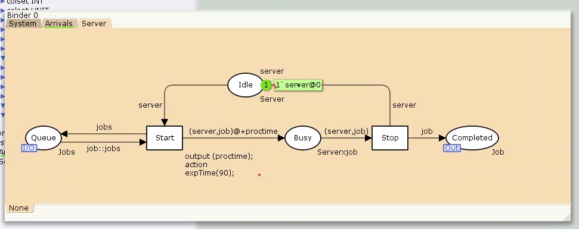{#fig:009 width=70%}

После задания всех необходимых параметров компоненты обработчика заявок активируются, и система начинает функционировать, как показано на рисунке ниже.

## Мониторинг параметров моделируемой системы

Для отслеживания параметров используется палитра **Monitoring**. В первую очередь добавляется **Break Point**, который размещается на переходе `Start`. После этого в меню **Monitor** появляется новый раздел, назовём его `Ostanovka`.

В этом разделе необходимо изменить функцию `Predicate`, отвечающую за условие активации монитора. Стандартное значение `true` заменяется на выражение `Queue_Delay.count()=200`, чтобы монитор срабатывал каждые 200 заявок.

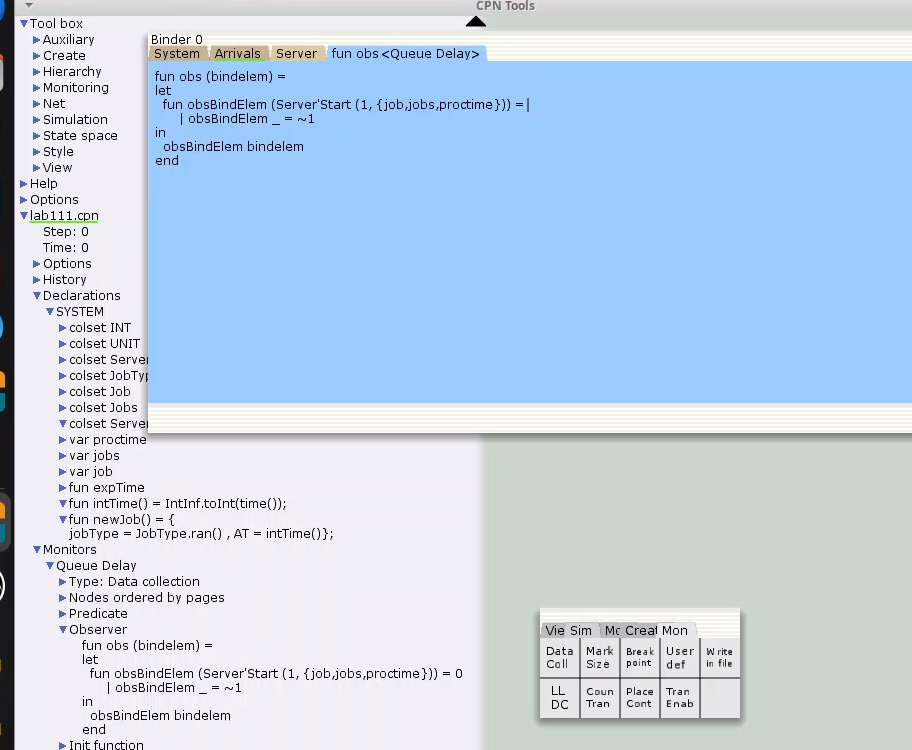

### Определение функции `Queue_Delay.count()`

С помощью палитры **Monitoring** выбирается элемент **Data Call**, который размещается также на переходе `Start`. Новый монитор следует назвать `Queue Delay` (без подчеркивания). 

Функция `Observer` будет выполняться, когда предикат возвращает `true`. По умолчанию она возвращает 0 или ~1, где подчёркивание обозначает произвольный аргумент. Чтобы получить значение задержки, нужно из текущего времени `intTime()` вычесть временную метку `AT`, которая указывает момент поступления заявки в очередь.

### Вычисление задержки в действительных значениях

Для получения задержки в виде действительных чисел, снова используется **Data Call** на переходе `Start`. Новый монитор называется `Queue Delay Real`. Функцию `Observer` следует изменить так, чтобы результат преобразовывался в тип `real` (например, используя `~1.0`).

После запуска системы в каталоге проекта появится файл `Queue_Delay_Real.log` с данными, аналогичными файлу `Queue_Delay.log`, но с действительными значениями.

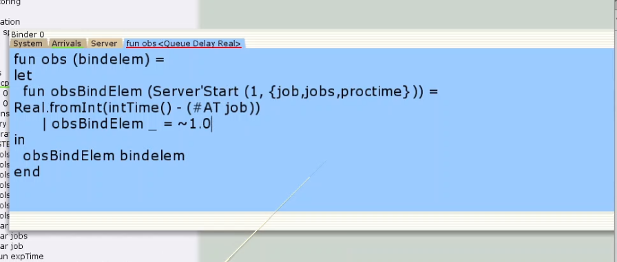

### Подсчёт случаев превышения задержки

Чтобы посчитать количество случаев, когда задержка превысила заданное значение, снова используется **Data Call** на переходе `Start`. Новый монитор следует назвать `Long Delay Time`, и изменить в нём функцию `Observer`, как показано ниже.

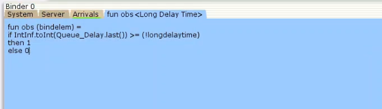

После запуска системы создается файл `Queue_Delay.log`, где:
- первая колонка — значение задержки,
- вторая — счётчик,
- третья — шаг,
- четвёртая — время.

С помощью **gnuplot** можно построить график изменения задержки, используя:
- по оси X — время,
- по оси Y — значения задержки.

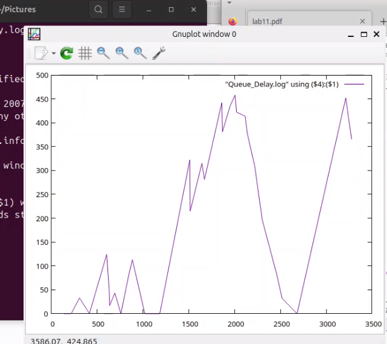

С помощью **gnuplot** можно построить график, иллюстрирующий периоды времени, в которые значения задержки в очереди превышали установленный порог — 200. Этот график помогает визуализировать моменты перегрузки в системе (см. рисунок ниже).

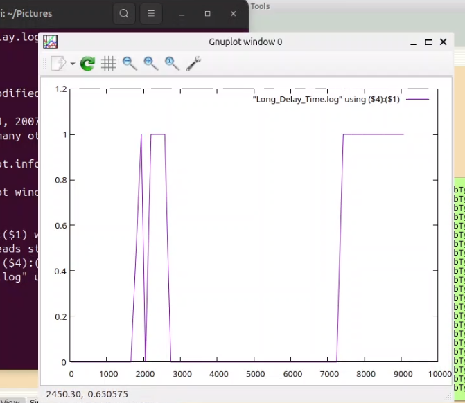

# Выводы

В рамках выполненной работы была разработана и реализована модель системы массового обслуживания **M|M|1** с использованием среды **CPN Tools**.

# Список литературы{.unnumbered}

::: {#refs}
:::
