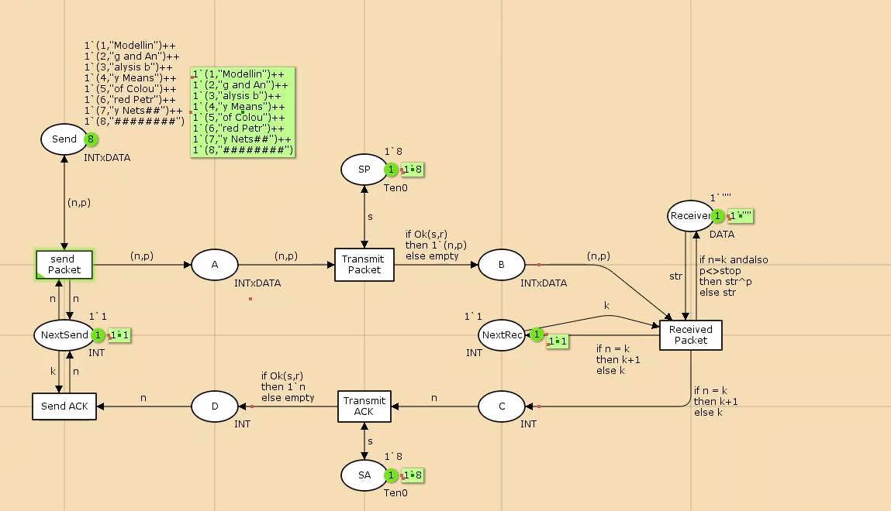

---
## Front matter
lang: ru-RU
title: Лабораторная работа № 12
subtitle: Пример моделирования простого протокола передачи данных
author:
  - Мугари Абдеррахим
institute:
  - Российский университет дружбы народов, Москва, Россия
date: 19 апреля 2025

## i18n babel
babel-lang: russian
babel-otherlangs: english

## Formatting pdf
toc: false
toc-title: Содержание
slide_level: 2
aspectratio: 169
section-titles: true
theme: metropolis
header-includes:
 - \metroset{progressbar=frametitle,sectionpage=progressbar,numbering=fraction}
---

# Информация

## Преподаватель 

:::::::::::::: {.columns align=center}
::: {.column width="70%"}

  * Анна Владиславовна Королькова
  * доцент кафедры прикладной информатики и теории вероятностей РУДН; 
  * заведующий лабораторией кафедры прикладной информатики и теории вероятностей РУДН (по совместительству); 
  *  программист I кат. 
  * Российский университет дружбы народов
  * [korolkova-av@rudn.ru](mailto:korolkova-av@rudn.ru)

:::
::: {.column width="30%"}


:::
::::::::::::::

## Докладчик

:::::::::::::: {.columns align=center}
::: {.column width="70%"}

  * Мугари Абдеррахим
  * Студент третьего курса 
  * фундаментальная информатика и информационные технологии
  * Российский университет дружбы народов
  * [1032215692@rudn.ru](mailto:1032215692@rudn.ru)
  * <https://iragoum.github.io/>

:::
::: {.column width="30%"}


:::
::::::::::::::

## Цель работы

Реализовать простой протокол передачи данных в CPN Tools.

**Задание**

- Реализовать протокол передачи данных.
- Вычислить пространство состояний, сформировать отчет и построить граф.

## Выполнение лабораторной работы

Основные состояния: источник (Send) и получатель (Receiver).

Действия (переходы): отправка пакета (Send Packet) и отправка подтверждения (Send ACK).

Промежуточное состояние: следующий посылаемый пакет (NextSend).

Определим декларации модели 

- **DATA**: множество строк для передачи.
- **INTxDATA**: кортеж из номера пакета и строки.
- **Переменные**:
  - `n`, `k` (тип int): номера текущего и следующего пакетов.
  - `p` (тип str): передаваемая строка.
  - `stop` (тип DATA): стоп-символ ("########").
  
## Выполнение лабораторной работы

Добавим вероятность потери пакетов через переменные `s` и `v` типов Ten0 и Ten1 (значения от 0 до 10). Функция `Ok` определяет успешность передачи.

{width=30%}

## Выполнение лабораторной работы

Состояние `Send` имеет тип INTxDATA и начальную маркировку. Стоповый байт ("########") указывает конец сообщения. Состояние `Receiver` хранит данные (тип DATA) и начинается с пустой строки. Состояние `NextSend` типа INT инициализируется значением 1'1.

## Выполнение лабораторной работы

Переход `Send Packet` связан с состоянием `NextSend` через дуги с выражениями `n` и `k`. Промежуточные состояния `A`, `B`, `C`, `D` помогают управлять передачей данных и подтверждений.

Добавлен переход `Receive Packet`, который проверяет номер пакета и добавляет данные к полученной строке, если номер совпадает. Состояние `NextRec` управляет номером следующего ожидаемого пакета.


## Выполнение лабораторной работы

На переходах `Transmit Packet` и `Transmit ACK` задана вероятность потери пакетов через пороговое значение. Для этого используются вспомогательные состояния `SP` и `SA` с начальным значением 1`8.

{width=50%}

## Выполнение лабораторной работы

Модель простого протокола передачи данных показана на рисунке ниже. Пакеты последовательно проходят через состояния и переходы, пока не будет передана вся информация, завершающаяся стоп-последовательностью.

{width=50%}


## Упражнение

Вычислим пространство состояний. Для этого используется инструмент **Войти в пространство состояний**, который формирует код для анализа. Процесс может занять некоторое время. Если предполагается, что пространство состояний будет небольшим, можно сразу применить инструмент **Вычислить пространство состояний** к листу с сетью. После вычисления сформируем отчет и сохраним его с помощью инструмента **Сохранить отчет о пространстве состояний**, указав имя файла. 

## Анализ отчета

Из отчета можно выделить следующие ключевые моменты:

- **Общая статистика**:
  - Количество состояний: 20711.
  - Количество переходов: 333468.

- **Границы значений элементов**:
  - Промежуточные состояния `A`, `B`, `C`: наибольшая верхняя граница у `A` (так как после него возможна потеря пакетов). У состояния `B` верхняя граница равна 10.
  - Вспомогательные состояния `SP`, `SA`, `NextRec`, `NextSend`, `Receiver`: в них может находиться только один пакет.
  - Состояние `Send`: содержит только 8 элементов (задано изначально и не изменяется).

- **Границы в виде мультимножеств**: указаны для каждого состояния.

## Анализ отчета

- **Маркировка**:
  - **Home маркировка**: отсутствует, так как из-за вероятности потери пакетов нет состояний, достижимых из любого другого.
  - **Dead маркировка**: 8782 состояний [24890,24889,24888,24887,24886,...]. Это состояния, в которых нет активных переходов.

- **Частота событий**:
  - Бесконечно часто происходят события **Send_Packet** и **Transmit_Packet** (они поддерживают передачу данных).
  - Переходы **Send_ACK**, **Transmit_ACK**, **Receive_Packet** не имеют гарантии справедливости (возможны бесконечные последовательности, но они не срабатывают из-за условий перехода).
  
  
## Анализ отчета

```

CPN Tools state space report for:
/home/openmodelica/lab122.cpn
Report generated: Sun Apr 27 02:35:23 2025
 Statistics
------------------------------------------------------------------------
  State Space
     Nodes:  24890
     Arcs:   398949
     Secs:   300
     Status: Partial

  Scc Graph
     Nodes:  13103
     Arcs:   333167
     Secs:   19
```

## Анализ отчета

```

 Boundedness Properties
------------------------------------------------------------------------

  Best Integer Bounds       Upper      Lower
     lab12'A 1               21         0
     lab12'B 1               10         0
     lab12'C 1               7          0
     lab12'D 1               5          0
     lab12'NextRec 1         1          1
     lab12'NextSend 1        1          1
     lab12'Receiver 1        1          1
     lab12'SA 1              1          1
     lab12'SP 1              1          1
     lab12'Send 1            8          8
```
## Анализ отчета

```

  Best Upper Multi-set Bounds
     lab12'A 1           21`(1,"Modellin")++
17`(2,"g and An")++
12`(3,"alysis b")++
7`(4,"y Means")++
2`(5,"of Colou")
     lab12'B 1           10`(1,"Modellin")++
8`(2,"g and An")++
6`(3,"alysis b")++
3`(4,"y Means")++
1`(5,"of Colou")
     lab12'C 1           7`2++
5`3++
4`4++
```
## Анализ отчета

```

2`5
     lab12'D 1           5`2++
4`3++
3`4++
1`5
     lab12'NextRec 1     1`1++
1`2++
1`3++
1`4++
1`5
     lab12'NextSend 1    1`1++
1`2++
1`3++
1`4++
1`5

```
## Анализ отчета

```

     lab12'Receiver 1    1`""++
1`"Modellin"++
1`"Modelling and An"++
1`"Modelling and Analysis b"++
1`"Modelling and Analysis by Means"
     lab12'SA 1          1`8
     lab12'SP 1          1`8
     lab12'Send 1        1`(1,"Modellin")++
1`(2,"g and An")++
1`(3,"alysis b")++
1`(4,"y Means")++
1`(5,"of Colou")++
1`(6,"red Petr")++
1`(7,"y Nets##")++
1`(8,"########")

```
## Анализ отчета

```

  Best Lower Multi-set Bounds
     lab12'A 1           empty
     lab12'B 1           empty
     lab12'C 1           empty
     lab12'D 1           empty
     lab12'NextRec 1     empty
     lab12'NextSend 1    empty
     lab12'Receiver 1    empty
     lab12'SA 1          1`8
     lab12'SP 1          1`8
     lab12'Send 1        1`(1,"Modellin")++
1`(2,"g and An")++
1`(3,"alysis b")++
1`(4,"y Means")++
1`(5,"of Colou")++
1`(6,"red Petr")++
1`(7,"y Nets##")++
1`(8,"########")

```
## Анализ отчета

```

 Home Properties
------------------------------------------------------------------------
  Home Markings
     None
 Liveness Properties
------------------------------------------------------------------------
  Dead Markings
     8782 [24890,24889,24888,24887,24886,...]
  Dead Transition Instances
     None
  Live Transition Instances
     None
 Fairness Properties
------------------------------------------------------------------------
       lab12'Received_Packet 1
                         No Fairness
       lab12'Send_ACK 1       No Fairness
       lab12'Transmit_ACK 1   No Fairness
       lab12'Transmit_Packet 1
                         Impartial
       lab12'send_Packet 1    Impartial
```


## Анализ отчета

Сформируем начало графа пространства состояний. Из-за большого количества состояний отображается только его фрагмент 

{width=50%}

# Выводы

В ходе выполнения работы был реализован в CPN Tools простой протокол передачи данных. Также был проведен анализ пространства состояний, включая вычисление переходов, формирование отчета и построение графа состояний.

