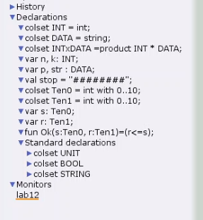
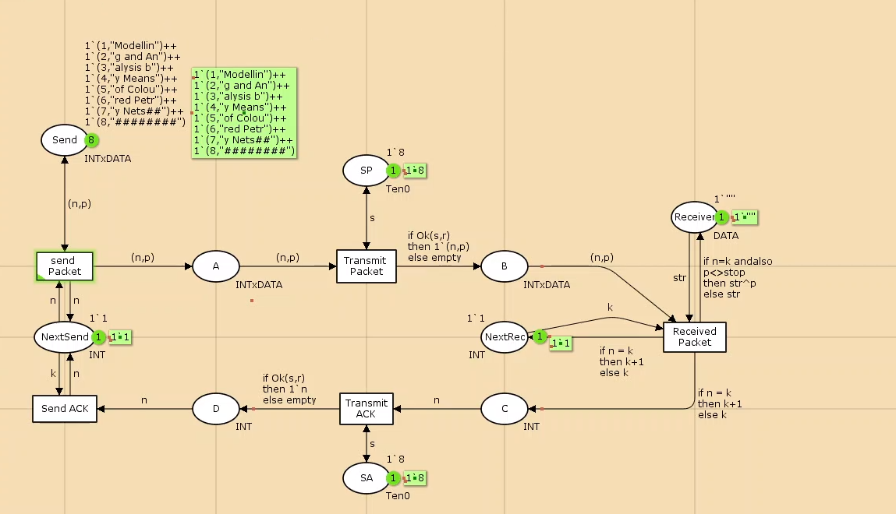
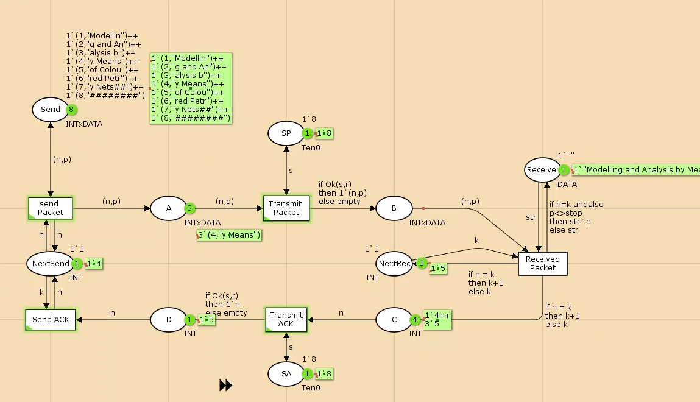
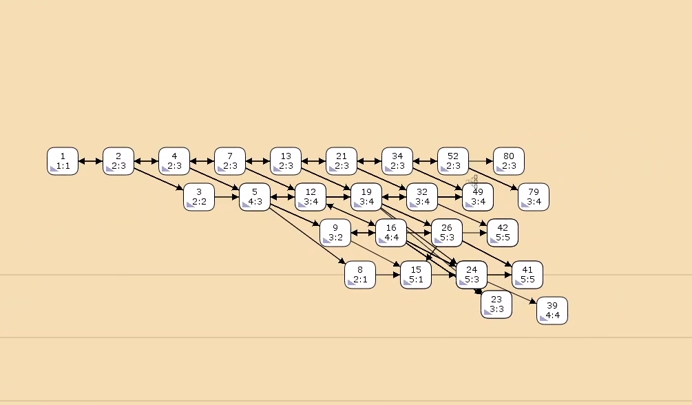

---
## Front matter
title: "Лабораторная работа №12"
subtitle: "Пример моделирования простого протокола передачи данных"
author: "Мугари Абдеррахим"

## Generic otions
lang: ru-RU
toc-title: "Содержание"

## Bibliography
bibliography: bib/cite.bib
csl: pandoc/csl/gost-r-7-0-5-2008-numeric.csl

## Pdf output format
toc: true # Table of contents
toc-depth: 2
lof: true # List of figures
lot: false # List of tables
fontsize: 12pt
linestretch: 1.5
papersize: a4
documentclass: scrreprt
## I18n polyglossia
polyglossia-lang:
  name: russian
  options:
	- spelling=modern
	- babelshorthands=true
polyglossia-otherlangs:
  name: english
## I18n babel
babel-lang: russian
babel-otherlangs: english
## Fonts
mainfont: IBM Plex Serif
romanfont: IBM Plex Serif
sansfont: IBM Plex Sans
monofont: IBM Plex Mono
mathfont: STIX Two Math
mainfontoptions: Ligatures=Common,Ligatures=TeX,Scale=0.94
romanfontoptions: Ligatures=Common,Ligatures=TeX,Scale=0.94
sansfontoptions: Ligatures=Common,Ligatures=TeX,Scale=MatchLowercase,Scale=0.94
monofontoptions: Scale=MatchLowercase,Scale=0.94,FakeStretch=0.9
mathfontoptions:
## Biblatex
biblatex: true
biblio-style: "gost-numeric"
biblatexoptions:
  - parentracker=true
  - backend=biber
  - hyperref=auto
  - language=auto
  - autolang=other*
  - citestyle=gost-numeric
## Pandoc-crossref LaTeX customization
figureTitle: "Рис."
tableTitle: "Таблица"
listingTitle: "Листинг"
lofTitle: "Список иллюстраций"
lotTitle: "Список таблиц"
lolTitle: "Листинги"
## Misc options
indent: true
header-includes:
  - \usepackage{indentfirst}
  - \usepackage{float} # keep figures where there are in the text
  - \floatplacement{figure}{H} # keep figures where there are in the text
---

# Введение

## Цели и задачи

**Цель работы**

Реализовать простой протокол передачи данных в CPN Tools.

**Задание**

- Реализовать протокол передачи данных.
- Вычислить пространство состояний, сформировать отчет и построить граф.

# Выполнение лабораторной работы

Основные состояния: источник (Send) и получатель (Receiver).

Действия (переходы): отправка пакета (Send Packet) и отправка подтверждения (Send ACK).

Промежуточное состояние: следующий посылаемый пакет (NextSend).

Определим декларации модели (рис. [-@fig:001]

- **DATA**: множество строк для передачи.
- **INTxDATA**: кортеж из номера пакета и строки.
- **Переменные**:
  - `n`, `k` (тип int): номера текущего и следующего пакетов.
  - `p` (тип str): передаваемая строка.
  - `stop` (тип DATA): стоп-символ ("########").

Добавим вероятность потери пакетов через переменные `s` и `v` типов Ten0 и Ten1 (значения от 0 до 10). Функция `Ok` определяет успешность передачи.

{#fig:001 width=70%}

Состояние `Send` имеет тип INTxDATA и начальную маркировку. Стоповый байт ("########") указывает конец сообщения. Состояние `Receiver` хранит данные (тип DATA) и начинается с пустой строки. Состояние `NextSend` типа INT инициализируется значением 1'1.

Переход `Send Packet` связан с состоянием `NextSend` через дуги с выражениями `n` и `k`. Промежуточные состояния `A`, `B`, `C`, `D` помогают управлять передачей данных и подтверждений.

Добавлен переход `Receive Packet`, который проверяет номер пакета и добавляет данные к полученной строке, если номер совпадает. Состояние `NextRec` управляет номером следующего ожидаемого пакета.

На переходах `Transmit Packet` и `Transmit ACK` задана вероятность потери пакетов через пороговое значение. Для этого используются вспомогательные состояния `SP` и `SA` с начальным значением 1`8.

{#fig:003 width=70%}

Модель простого протокола передачи данных показана на рисунке ниже. Пакеты последовательно проходят через состояния и переходы, пока не будет передана вся информация, завершающаяся стоп-последовательностью.

{#fig:004 width=70%}

## Упражнение

## Упражнение

Вычислим пространство состояний. Для этого используется инструмент **Войти в пространство состояний**, который формирует код для анализа. Процесс может занять некоторое время. Если предполагается, что пространство состояний будет небольшим, можно сразу применить инструмент **Вычислить пространство состояний** к листу с сетью. После вычисления сформируем отчет и сохраним его с помощью инструмента **Сохранить отчет о пространстве состояний**, указав имя файла. [@l:bash].

### Анализ отчета

Из отчета можно выделить следующие ключевые моменты:

- **Общая статистика**:
  - Количество состояний: 20711.
  - Количество переходов: 333468.

- **Границы значений элементов**:
  - Промежуточные состояния `A`, `B`, `C`: наибольшая верхняя граница у `A` (так как после него возможна потеря пакетов). У состояния `B` верхняя граница равна 10.
  - Вспомогательные состояния `SP`, `SA`, `NextRec`, `NextSend`, `Receiver`: в них может находиться только один пакет.[@cpn:bash].
  - Состояние `Send`: содержит только 8 элементов (задано изначально и не изменяется).

- **Границы в виде мультимножеств**: указаны для каждого состояния.

- **Маркировка**:
  - **Home маркировка**: отсутствует, так как из-за вероятности потери пакетов нет состояний, достижимых из любого другого.
  - **Dead маркировка**: 8782 состояний [24890,24889,24888,24887,24886,...]. Это состояния, в которых нет активных переходов.

- **Частота событий**:
  - Бесконечно часто происходят события **Send_Packet** и **Transmit_Packet** (они поддерживают передачу данных).
  - Переходы **Send_ACK**, **Transmit_ACK**, **Receive_Packet** не имеют гарантии справедливости (возможны бесконечные последовательности, но они не срабатывают из-за условий перехода).
  
```

CPN Tools state space report for:
/home/openmodelica/lab122.cpn
Report generated: Sun Apr 27 02:35:23 2025


 Statistics
------------------------------------------------------------------------

  State Space
     Nodes:  24890
     Arcs:   398949
     Secs:   300
     Status: Partial

  Scc Graph
     Nodes:  13103
     Arcs:   333167
     Secs:   19


 Boundedness Properties
------------------------------------------------------------------------

  Best Integer Bounds
                             Upper      Lower
     lab12'A 1               21         0
     lab12'B 1               10         0
     lab12'C 1               7          0
     lab12'D 1               5          0
     lab12'NextRec 1         1          1
     lab12'NextSend 1        1          1
     lab12'Receiver 1        1          1
     lab12'SA 1              1          1
     lab12'SP 1              1          1
     lab12'Send 1            8          8

  Best Upper Multi-set Bounds
     lab12'A 1           21`(1,"Modellin")++
17`(2,"g and An")++
12`(3,"alysis b")++
7`(4,"y Means")++
2`(5,"of Colou")
     lab12'B 1           10`(1,"Modellin")++
8`(2,"g and An")++
6`(3,"alysis b")++
3`(4,"y Means")++
1`(5,"of Colou")
     lab12'C 1           7`2++
5`3++
4`4++
2`5
     lab12'D 1           5`2++
4`3++
3`4++
1`5
     lab12'NextRec 1     1`1++
1`2++
1`3++
1`4++
1`5
     lab12'NextSend 1    1`1++
1`2++
1`3++
1`4++
1`5
     lab12'Receiver 1    1`""++
1`"Modellin"++
1`"Modelling and An"++
1`"Modelling and Analysis b"++
1`"Modelling and Analysis by Means"
     lab12'SA 1          1`8
     lab12'SP 1          1`8
     lab12'Send 1        1`(1,"Modellin")++
1`(2,"g and An")++
1`(3,"alysis b")++
1`(4,"y Means")++
1`(5,"of Colou")++
1`(6,"red Petr")++
1`(7,"y Nets##")++
1`(8,"########")

  Best Lower Multi-set Bounds
     lab12'A 1           empty
     lab12'B 1           empty
     lab12'C 1           empty
     lab12'D 1           empty
     lab12'NextRec 1     empty
     lab12'NextSend 1    empty
     lab12'Receiver 1    empty
     lab12'SA 1          1`8
     lab12'SP 1          1`8
     lab12'Send 1        1`(1,"Modellin")++
1`(2,"g and An")++
1`(3,"alysis b")++
1`(4,"y Means")++
1`(5,"of Colou")++
1`(6,"red Petr")++
1`(7,"y Nets##")++
1`(8,"########")


 Home Properties
------------------------------------------------------------------------

  Home Markings
     None


 Liveness Properties
------------------------------------------------------------------------

  Dead Markings
     8782 [24890,24889,24888,24887,24886,...]

  Dead Transition Instances
     None

  Live Transition Instances
     None


 Fairness Properties
------------------------------------------------------------------------
       lab12'Received_Packet 1
                         No Fairness
       lab12'Send_ACK 1       No Fairness
       lab12'Transmit_ACK 1   No Fairness
       lab12'Transmit_Packet 1
                         Impartial
       lab12'send_Packet 1    Impartial
```

Сформируем начало графа пространства состояний. Из-за большого количества состояний отображается только его фрагмент (рис. [-@fig:004]).

{#fig:005 width=70%}

# Выводы

В ходе выполнения работы был реализован в CPN Tools простой протокол передачи данных. Также был проведен анализ пространства состояний, включая вычисление переходов, формирование отчета и построение графа состояний.

# Список литературы{.unnumbered}

::: {#refs}
:::
