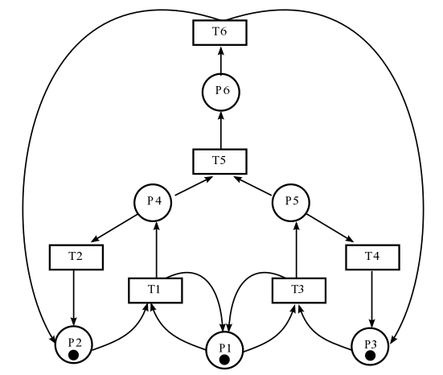
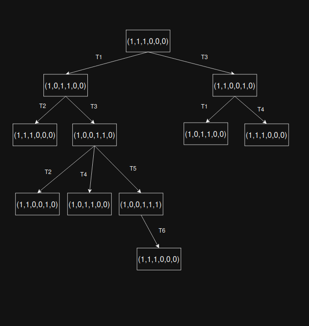
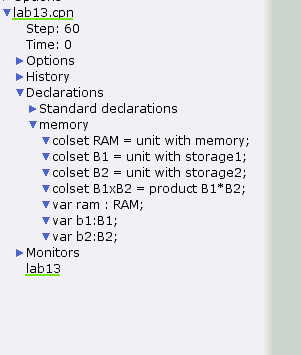
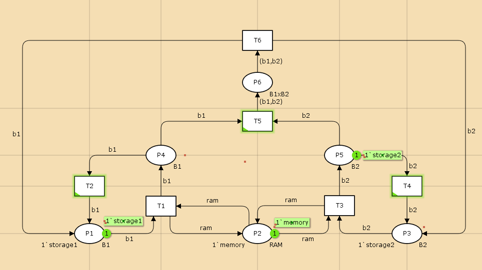
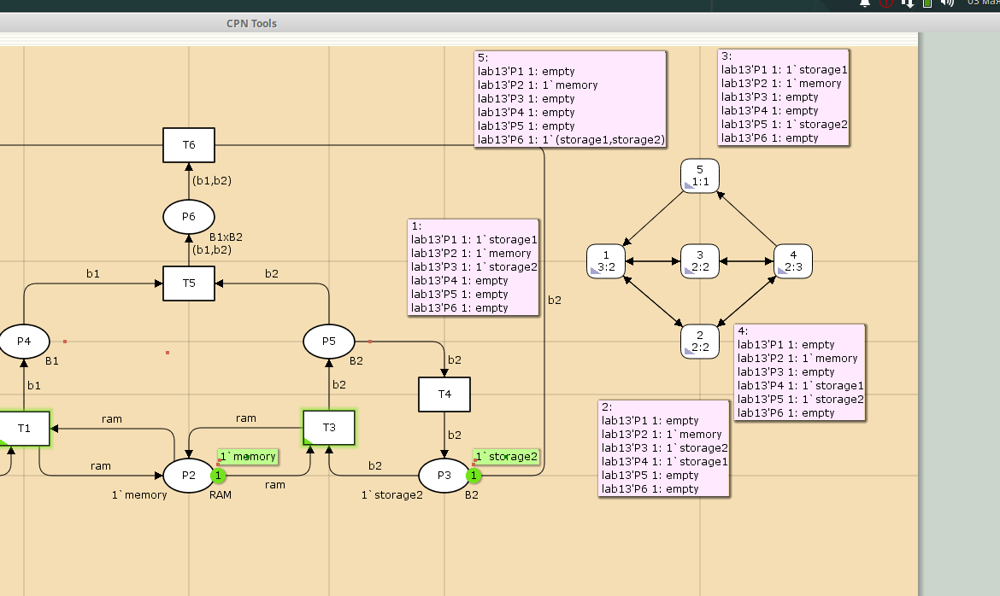

---
## Front matter
lang: ru-RU
title: Лабораторная работа № 13
subtitle: Задание для самостоятельного выполнения
author:
  - Мугари Абдеррахим
institute:
  - Российский университет дружбы народов, Москва, Россия
date: 03 мая 2025

## i18n babel
babel-lang: russian
babel-otherlangs: english

## Formatting pdf
toc: false
toc-title: Содержание
slide_level: 2
aspectratio: 169
section-titles: true
theme: metropolis
header-includes:
 - \metroset{progressbar=frametitle,sectionpage=progressbar,numbering=fraction}
---

# Информация

## Преподаватель 

:::::::::::::: {.columns align=center}
::: {.column width="70%"}

  * Анна Владиславовна Королькова
  * доцент кафедры прикладной информатики и теории вероятностей РУДН; 
  * заведующий лабораторией кафедры прикладной информатики и теории вероятностей РУДН (по совместительству); 
  *  программист I кат. 
  * Российский университет дружбы народов
  * [korolkova-av@rudn.ru](mailto:korolkova-av@rudn.ru)

:::
::: {.column width="30%"}


:::
::::::::::::::

## Докладчик

:::::::::::::: {.columns align=center}
::: {.column width="70%"}

  * Мугари Абдеррахим
  * Студент третьего курса 
  * фундаментальная информатика и информационные технологии
  * Российский университет дружбы народов
  * [1032215692@rudn.ru](mailto:1032215692@rudn.ru)
  * <https://iragoum.github.io/>

:::
::: {.column width="30%"}


:::
::::::::::::::

# Введение
## Цели и задачи
**Цель работы**: Анализ и моделирование сети Петри с использованием CPN Tools.

**Задание**:

1. Используя теоретические методы анализа сетей Петри, провести анализ заданной сети с помощью построения дерева достижимости. Определить, является ли сеть безопасной, ограниченной, сохраняющей, имеются ли тупики.

2. Промоделировать сеть Петри с помощью CPNTools.

3. Вычислить пространство состояний, сформировать отчёт о пространстве состояний и проанализировать его. Построить граф пространства состояний.

# Выполнение лабораторной работы

## Описание модели

Согласно заданию, рассматривается следующая модель: заявка (команды программы, операнды) поступает в оперативную память (ОП), затем передается на прибор (центральный процессор, ЦП) для обработки. После этого заявка может равновероятно обратиться к оперативной памяти или к одному из двух внешних запоминающих устройств (B1 и B2). Прежде чем записать информацию на внешний накопитель, необходимо вторично обратиться к центральному процессору, определяющему состояние накопителя и выдающему необходимую управляющую информацию.

Накопители (B1 и B2) могут работать в 3-х режимах:

1) B1 — занят, B2 — свободен;

2) B2 — свободен, B1 — занят;

3) B1 — занят, B2 — занят.

## Описание модели

Для данной модели определены следующие элементы сети Петри:

**Множество позиций**:

- P1 — состояние оперативной памяти (свободна / занята);

- P2 — состояние внешнего запоминающего устройства B1 (свободно / занято);

- P3 — состояние внешнего запоминающего устройства B2 (свободно / занято);

- P4 — работа на ОП и B1 закончена;

- P5 — работа на ОП и B2 закончена;

- P6 — работа на ОП, B1 и B2 закончена;

## Описание модели

**Множество переходов**:

- T1 — ЦП работает только с RAM и B1;

- T2 — обрабатываются данные из RAM и с B1 переходят на устройство вывода;

- T3 — CPU работает только с RAM и B2;

- T4 — обрабатываются данные из RAM и с B2 переходят на устройство вывода;

- T5 — CPU работает только с RAM и с B1, B2;

- T6 — обрабатываются данные из RAM, B1, B2 и переходят на устройство вывода.

## Описание модели

Начальная маркировка: M0 = (1, 1, 1, 0, 0, 0)

{#fig:001 width=40%}

## Теоретический анализ сети Петри

### Построение дерева достижимости

Используя теоретические методы анализа, построим дерево достижимости для заданной сети Петри. 

1. Из состояния M0 = (1, 1, 1, 0, 0, 0):
   - Может сработать переход T1, что приведет к M1 = (1, 0, 1, 1, 0, 0)
   - Может сработать переход T3, что приведет к M2 = (1, 1, 0, 0, 1, 0)
   
2. Из состояния M1 = (1, 0, 1, 1, 0, 0):
   - Может сработать переход T2, что вернет систему в M0 = (1, 1, 1, 0, 0, 0)
   - Может сработать переход T3, что приведет к M4 = (1, 0, 0, 1, 1, 0)
   
3. Из состояния M2 = (1, 1, 0, 0, 1, 0):
   - Может сработать переход T1, что приведет к M4 = (1, 0, 0, 1, 1, 0)
   - Может сработать переход T4, что вернет систему в M0 = (1, 1, 1, 0, 0, 0)
   
## Теоретический анализ сети Петри
   
4. Из состояния M4 = (1, 0, 0, 1, 1, 0):
   - Может сработать переход T5, что приведет к M5 = (1, 0, 0, 0, 0, 1)
   - Может сработать переход T3, что приведет к M2 = (1, 1, 0, 0, 1, 0)
   - Может сработать переход T1, что приведет к M1 = (1, 0, 1, 1, 0, 0)
   
5. Из состояния M5 = (1, 0, 0, 0, 0, 1):
   - Может сработать переход T6, что вернет систему в M0 = (1, 1, 1, 0, 0, 0)

## Теоретический анализ сети Петри

{#fig:002 width=40%}

## Результаты анализа

На основе построенного дерева достижимости можно сделать следующие выводы:

1. **Безопасность**: Сеть является безопасной, так как в каждой позиции никогда не находится более одного маркера.

2. **Ограниченность**: Сеть является ограниченной с границей k = 1, так как количество маркеров в любой позиции не превышает 1.

3. **Сохраняемость**: Сеть не сохраняющая, так как суммарное количество маркеров во всех состояниях сети постоянно не равно 3. 

4. **Тупики**: В сети нет тупиков (deadlocks), т.к. из любого достижимого состояния есть возможность перейти в другое состояние (нет маркировок, из которых нельзя выполнить ни один переход). 

## Моделирование сети Петри в CPNTools

Для моделирования сети Петри в CPNTools была создана модель в соответствии с заданной структурой. На рисунке ниже представлена разработанная модель сети в CPNTools.


{#fig:003 width=20%}


## Модель сети Петри в CPNTools

{#fig:004 width=50%}

В модели созданы следующие элементы:
- Позиции P1-P6 с соответствующими начальными маркировками
- Переходы T1-T6 с необходимыми связями
- Дуги, соединяющие позиции и переходы

## Результаты анализа

Начальная маркировка:

- P1 = 1 (RAM свободна)

- P2 = 1 (B1 свободно)

- P3 = 1 (B2 свободно)

- P4 = 0 (работа на ОП и B1 закончена)

- P5 = 0 (работа на ОП и B2 закончена)

- P6 = 0 (работа на ОП, B1 и B2 закончена)

## Вычисление пространства состояний

После создания модели было вычислено пространство состояний сети Петри с помощью инструментов CPNTools. Был сформирован отчет и построен граф пространства состояний.

{#fig:005 width=50%}

## Анализ отчета о пространстве состояний

```
CPN Tools state space report for:
/home/openmodelica/lab13.cpn
Report generated: Sat May  3 21:25:13 2025
 Statistics
------------------------------------------------------------------------
  State Space
     Nodes:  5
     Arcs:   10
     Secs:   0
     Status: Full
  Scc Graph
     Nodes:  1
     Arcs:   0
     Secs:   0

```
## Анализ отчета о пространстве состояний

```

 Boundedness Properties
------------------------------------------------------------------------
  Best Integer Bounds
                             Upper      Lower
     lab13'P1 1              1          0
     lab13'P2 1              1          1
     lab13'P3 1              1          0
     lab13'P4 1              1          0
     lab13'P5 1              1          0
     lab13'P6 1              1          0
  Best Upper Multi-set Bounds
     lab13'P1 1          1`storage1
     lab13'P2 1          1`memory
     lab13'P3 1          1`storage2
     lab13'P4 1          1`storage1
     lab13'P5 1          1`storage2
     lab13'P6 1          1`(storage1,storage2)
```

## Анализ отчета о пространстве состояний

```

  Best Lower Multi-set Bounds
     lab13'P1 1          empty
     lab13'P2 1          1`memory
     lab13'P3 1          empty
     lab13'P4 1          empty
     lab13'P5 1          empty
     lab13'P6 1          empty
 Home Properties
------------------------------------------------------------------------
  Home Markings
     All

```
## Анализ отчета о пространстве состояний

```

 Liveness Properties
------------------------------------------------------------------------
  Dead Markings
     None
  Dead Transition Instances
     None
  Live Transition Instances
     All
 Fairness Properties
------------------------------------------------------------------------
       lab13'T1 1             No Fairness
       lab13'T2 1             No Fairness
       lab13'T3 1             No Fairness
       lab13'T4 1             No Fairness
       lab13'T5 1             Just
       lab13'T6 1             Fair
```

## Анализ отчета о пространстве состояний

### Общая статистика
- Пространство состояний содержит 5 узлов и 10 дуг
- Статус: полное 
- Граф SCC содержит 1 узел без дуг

### Свойства ограниченности
- Все позиции являются 1-ограниченными (безопасными)
- Верхние и нижние границы для всех позиций определены корректно

### Свойства домашних состояний
- Все маркировки являются домашними 

## Анализ отчета о пространстве состояний

### Свойства живости
- Отсутствуют тупиковые маркировки 
- Отсутствуют мертвые переходы
- Все переходы являются живыми 

### Свойства справедливости
- Переходы T1, T2, T3, T4 не обладают свойством справедливости
- Переход T5 является справедливым 
- Переход T6 является строго справедливым 

# Выводы

В ходе выполнения лабораторной работы:

1. Был проведен теоретический анализ заданной сети Петри с помощью построения дерева достижимости. Установлено, что сеть является безопасной, ограниченной с границей k=1, сохраняющей, и в ней отсутствуют тупики.

2. Была создана модель сети Петри в среде CPNTools в соответствии с заданной структурой.

3. Было вычислено пространство состояний, сформирован и проанализирован отчет о пространстве состояний, построен граф пространства состояний.

Результаты анализа с помощью CPNTools подтвердили теоретические выводы о свойствах сети: она является безопасной, ограниченной, не сохраняющей и не содержит тупиков. 

